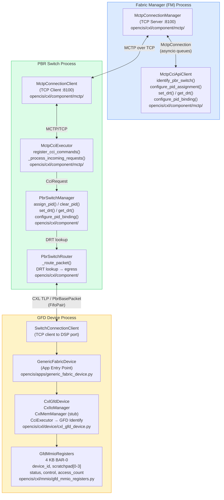
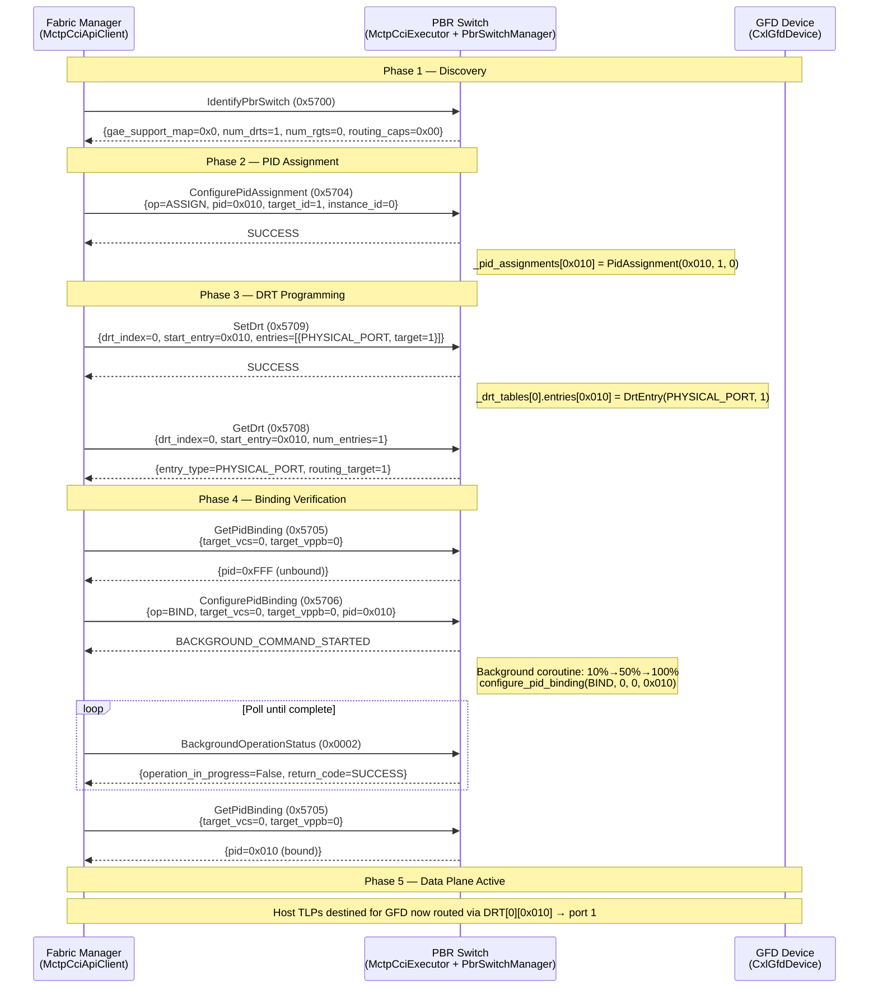
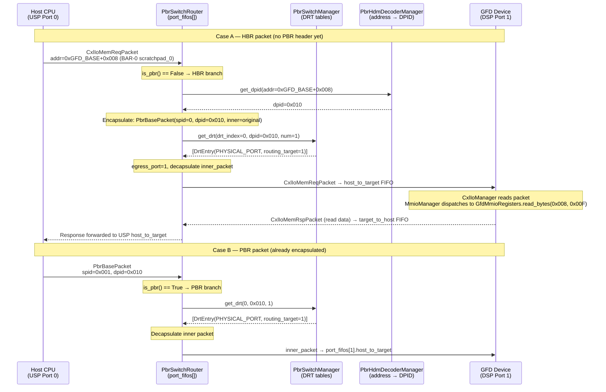
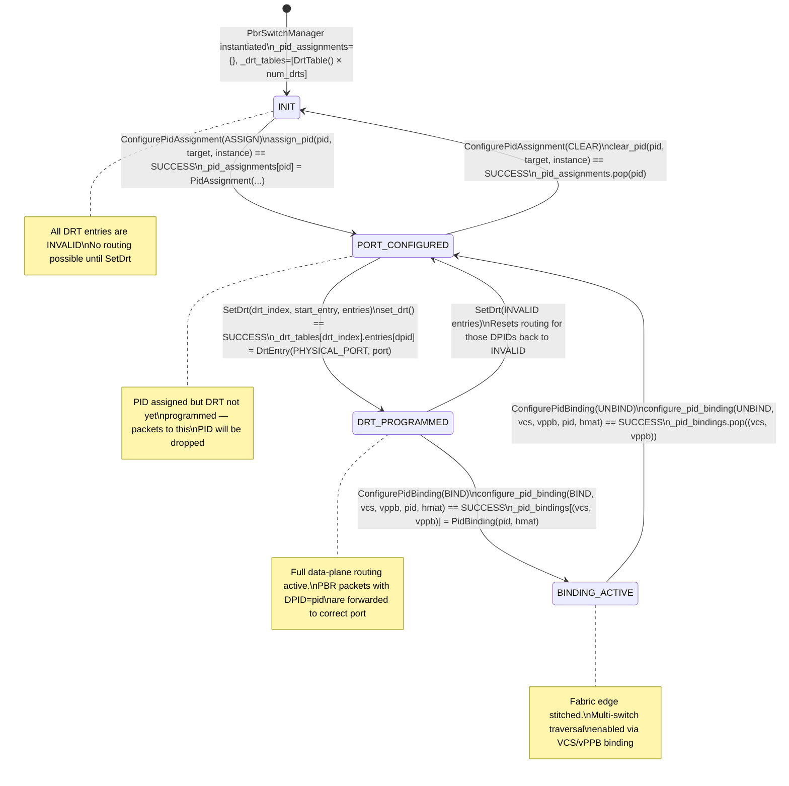
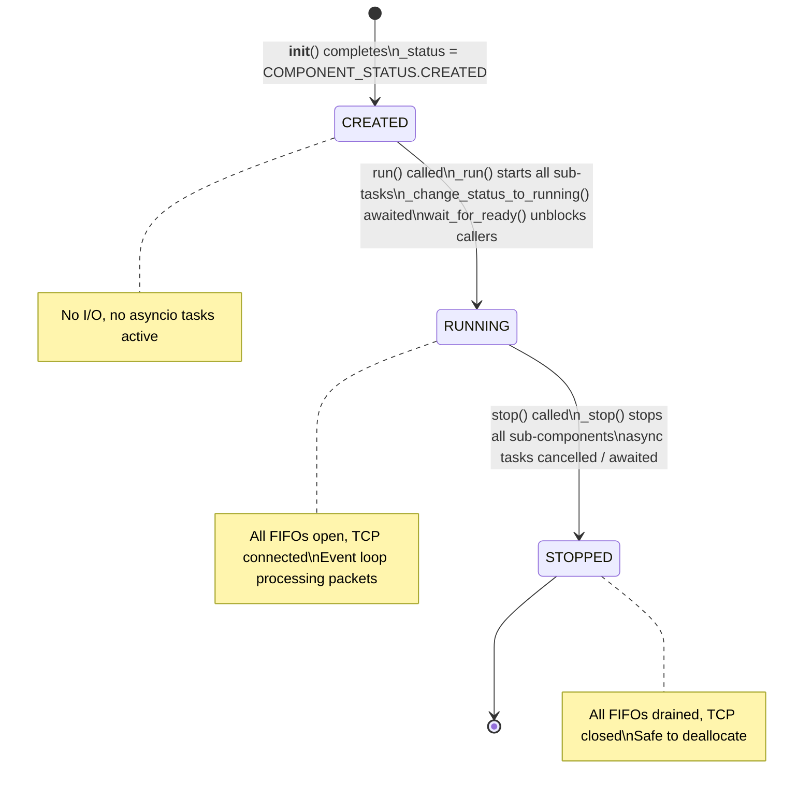
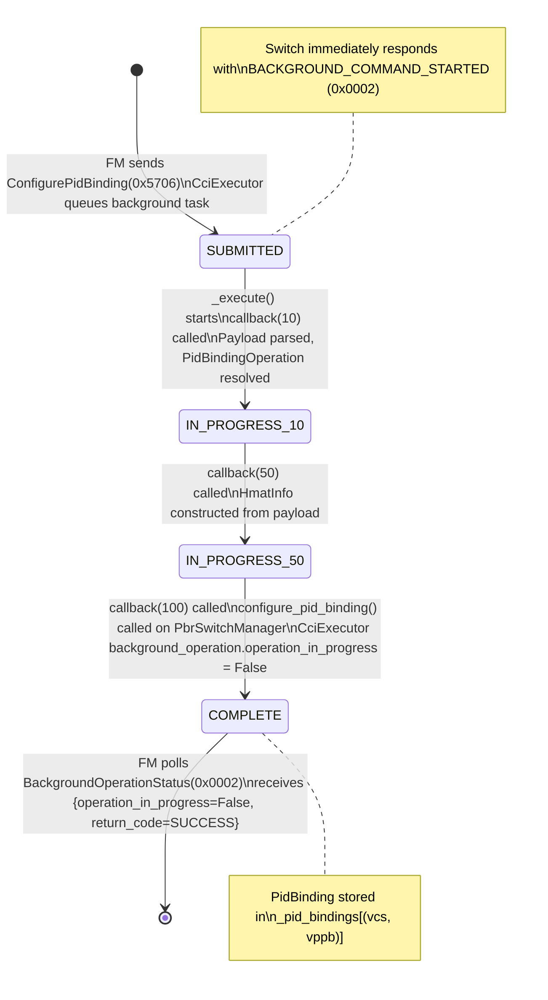

# Generic Fabric Device (GFD) — Complete Design Document

---

| Field       | Value                                          |
|-------------|------------------------------------------------|
| **Version** | 1.0                                            |
| **Date**    | May 2026                                       |
| **Status**  | Released                                       |
| **Authors** | Eeum, Inc. / opencis-core Contributors         |
| **Spec Ref**| CXL 4.0 Rev 1.0 §7.7.13 — PBR Switch Commands |
| **Project** | opencis-core CXL 4.0 Simulator                 |

---

## Table of Contents

1. [Executive Summary](#1-executive-summary)
2. [Architecture Overview](#2-architecture-overview)
3. [Component Descriptions](#3-component-descriptions)
4. [CCI Command Reference](#4-cci-command-reference)
5. [Sequence Diagrams](#5-sequence-diagrams)
6. [UML Class Diagram](#6-uml-class-diagram)
7. [State Machine Diagram](#7-state-machine-diagram)
8. [Traceability Matrix](#8-traceability-matrix)
9. [Integration Guide](#9-integration-guide)
10. [Test Coverage Summary](#10-test-coverage-summary)
11. [Troubleshooting Guide](#11-troubleshooting-guide)

---

## 1. Executive Summary

### What Is a Generic Fabric Device (GFD)?

A **Generic Fabric Device (GFD)** is a new device class introduced in **CXL 4.0** (Compute Express Link Specification, Revision 4.0, Version 1.0). It is defined in §7.7.13 under the Port-Based Routing (PBR) switch command set. A GFD is a CXL endpoint that attaches to a **Downstream Switch Port (DSP)** of a PBR-capable switch and participates in the fabric as an addressable entity through a **Port-Based Routing (PBR)** identifier called a **Port ID (PID)**.

Unlike a conventional CXL Type-3 Single Logical Device (SLD), which exports a Host-Managed Device Memory (HDM) region that the host maps through MMIO and manages through an HDM decoder hierarchy, a **GFD is CXL.io-only**. It:

- Exposes a **4 KB BAR-0 MMIO register block** containing scratchpad, status, and control registers.
- Has **no HDM decoders** (`hdm_count=0`, `mem_capable=0`, `cache_capable=0`).
- Is **identified to the Fabric Manager (FM)** via the standard CXL CCI `Identify` command (opcode `0x0001`) returning `IdentifyComponentType.GFD` (value `0x04`).
- Participates in **fabric routing** via PIDs managed by the switch's `PbrSwitchManager`.

### Why GFD Exists in CXL 4.0

PBR was introduced to break the rigid tree topology of classic CXL switches, enabling **arbitrary fabric topologies** — meshes, rings, fat-trees — where TLPs are routed by a PID embedded in the packet header rather than by positional hierarchy. In such a fabric, there must be a device class that:

1. **Attaches to a fabric edge** (a switch DSP port) and is reachable by a PID.
2. **Exposes programmable registers** that the FM or host can read/write over CXL.io.
3. **Reports its identity** to the FM without requiring full Type-3 memory semantics.

GFD fulfils all three requirements. It is the fabric's "generic compute/IO node" — a lightweight peer that can be stitched into a multi-switch fabric using only the PBR control-plane CCI commands.

### GFD vs. SLD — Key Differences

| Attribute                  | SLD (Type-3)                         | GFD (CXL 4.0)                          |
|----------------------------|--------------------------------------|-----------------------------------------|
| `component_type` (Identify)| `0x03` — Memory Device               | `0x04` — GFD                            |
| HDM decoders               | 1–16 (memory-mapped range)           | 0 (none)                                |
| `mem_capable`              | 1                                    | 0                                       |
| `cache_capable`            | 0 (Type-3) or 1 (Type-2)            | 0                                       |
| BAR-0 size                 | ≥4 KB (device-specific)              | Exactly 4 KB (`GFD_BAR_SIZE = 0x1000`) |
| Fabric participation       | Via HDM address → host DVSEC decodes | Via PID assignment + DRT programming   |
| Connectivity model         | Classic HBR hierarchy                | PBR topology, SPID/DPID headers         |
| FM control commands        | `BindVppb`, `UnbindVppb`             | `ConfigurePidAssignment`, `SetDrt`, `ConfigurePidBinding` |
| Memory backing             | Physical DRAM / emulated file        | None (register file only)               |

### Role in the PBR Fabric

In the opencis-core simulator, the GFD acts as a **leaf node** in a PBR switch fabric. Its lifecycle during commissioning is:

1. The GFD device connects to the switch DSP port via `SwitchConnectionClient` (TCP in emulation).
2. The FM discovers the switch capabilities via `IdentifyPbrSwitch`.
3. The FM assigns a PID to the GFD's port via `ConfigurePidAssignment`.
4. The FM programs the switch's **DPID Routing Table (DRT)** via `SetDrt` so that packets destined for the GFD's PID are directed to the correct physical DSP port.
5. The FM optionally stitches multi-switch fabric edges via `ConfigurePidBinding`, which is a **background command** requiring link-state transitions.
6. The host or FM issues CXL.io reads/writes to BAR-0, which the `PbrSwitchRouter` forwards through the DRT to the GFD port, and the `CxlGfdDevice` services by reading/writing `GfdMmioRegisters`.

---

## 2. Architecture Overview

### 2.1 System-Level Block Diagram

```
┌─────────────────────────────────────────────────────────────────────────────┐
│                        FABRIC MANAGER (FM) SIDE                             │
│                                                                             │
│   ┌──────────────────────────┐      ┌─────────────────────────────────┐    │
│   │  MctpConnectionManager   │      │     MctpCciApiClient            │    │
│   │  (TCP server :8100)      │◄────►│  identify_pbr_switch()          │    │
│   │  get_mctp_connection()   │      │  configure_pid_assignment()      │    │
│   └──────────┬───────────────┘      │  set_drt()  get_drt()           │    │
│              │  MctpConnection      │  configure_pid_binding()         │    │
│              │  (asyncio queues)    │  get_pid_binding()               │    │
│              │                      └─────────────────────────────────┘    │
└──────────────│──────────────────────────────────────────────────────────────┘
               │
               │  MCTP-over-TCP  (CCI_MCTP_MESSAGE_CATEGORY.REQUEST/RESPONSE)
               │
┌──────────────▼──────────────────────────────────────────────────────────────┐
│                          PBR SWITCH SIDE                                    │
│                                                                             │
│   ┌─────────────────────┐    ┌───────────────────────┐                     │
│   │ MctpConnectionClient│    │    MctpCciExecutor     │                     │
│   │ (TCP client :8100)  │───►│  register_cci_commands │                     │
│   │ get_mctp_connection │    │  _process_incoming_    │                     │
│   └─────────────────────┘    │    requests()          │                     │
│                              │  _send_response()      │                     │
│                              └────────────┬───────────┘                     │
│                                           │ CciRequest / CciResponse        │
│                              ┌────────────▼───────────────────────────────┐ │
│                              │         PbrSwitchManager                   │ │
│                              │  _pid_targets[]   _pid_assignments{}       │ │
│                              │  _drt_tables[]    _pid_bindings{}          │ │
│                              │  assign_pid()     set_drt()                │ │
│                              │  configure_pid_binding()                   │ │
│                              └────────────┬───────────────────────────────┘ │
│                                           │ get_drt(dpid=X) → egress_port  │
│   ┌───────────────────────────────────────▼──────────────────────────────┐  │
│   │                       PbrSwitchRouter                                │  │
│   │  port_fifos[USP]  port_fifos[DSP0]  port_fifos[DSP1]  ...           │  │
│   │  _route_packet():                                                    │  │
│   │    is_pbr? → get_drt(DPID) → egress_port → forward/decapsulate      │  │
│   │    else   → HDM decode → DPID → encapsulate PbrBasePacket → recurse │  │
│   └──────────────────────────────┬────────────────────────────────────── ┘  │
│                                  │ FifoPair (host_to_target / target_to_host)│
└──────────────────────────────────│─────────────────────────────────────────-┘
                                   │  CXL TLP (PbrBasePacket over FifoPair)
┌──────────────────────────────────▼───────────────────────────────────────────┐
│                          GFD DEVICE SIDE                                     │
│                                                                              │
│  ┌───────────────────────────────────────────────────────────────────────┐  │
│  │                    GenericFabricDevice                                │  │
│  │  (opencis/apps/generic_fabric_device.py)                              │  │
│  │  Runnable wrapper — starts SwitchConnectionClient + CxlGfdDevice      │  │
│  └────────────────────────────────────┬──────────────────────────────────┘  │
│                                       │ TCP / test CxlConnection             │
│  ┌────────────────────────────────────▼──────────────────────────────────┐  │
│  │                      CxlGfdDevice                                     │  │
│  │  (opencis/cxl/device/cxl_gfd_device.py)                               │  │
│  │                                                                       │  │
│  │   CxlIoManager ────── BAR-0 ──────► GfdMmioRegisters (4 KB)          │  │
│  │   CxlMemManager (idle stub — no HDM decoders)                        │  │
│  │   CciExecutor ─────── Identify ────► IdentifyCommand(GFD, 0x04)      │  │
│  └───────────────────────────────────────────────────────────────────────┘  │
└──────────────────────────────────────────────────────────────────────────────┘
```

### 2.2 Mermaid Architecture Diagram



---

## 3. Component Descriptions

### 3.1 `GenericFabricDevice`

| Attribute   | Value                                                   |
|-------------|---------------------------------------------------------|
| **Class**   | `GenericFabricDevice`                                   |
| **File**    | `opencis/apps/generic_fabric_device.py`                 |
| **Base**    | `RunnableComponent`                                     |
| **Purpose** | Top-level application entry point for a GFD instance.  |

#### Description

`GenericFabricDevice` is the **runnable shell** that wires the TCP transport layer to the device logic. It provides two operating modes:

- **Normal mode**: Instantiates a `SwitchConnectionClient` that dials out to the PBR switch's DSP TCP port, then passes the resulting `CxlConnection` to `CxlGfdDevice`.
- **Test mode** (`test_mode=True`): Accepts a pre-built `CxlConnection` directly, bypassing TCP. This mode is used by all unit tests in `tests/test_gfd_device.py`.

#### Constructor Parameters

| Parameter       | Type         | Default               | Description                                              |
|-----------------|--------------|-----------------------|----------------------------------------------------------|
| `host`          | `str`        | `"0.0.0.0"`           | Switch hostname / IP                                     |
| `port`          | `int`        | `8000`                | Switch TCP port                                          |
| `port_index`    | `int`        | `1`                   | DSP port number the GFD connects to                      |
| `serial_number` | `str`        | `"0000000000000001"`  | 16-hex-digit serial (passed to `CxlGfdDevice`)           |
| `test_mode`     | `bool`       | `False`               | Bypass TCP; `cxl_connection` must be provided            |
| `cxl_connection`| `CxlConnection`| `None`              | Pre-built connection for test mode                       |

#### Key Methods

| Method                    | Signature                              | Description                                       |
|---------------------------|----------------------------------------|---------------------------------------------------|
| `get_gfd_device()`        | `() → CxlGfdDevice`                   | Returns the underlying device for test introspection |
| `_run()` *(async)*        | `() → None`                           | Starts `CxlGfdDevice` (+ `SwitchConnectionClient` if not test mode), waits for ready |
| `_stop()` *(async)*       | `() → None`                           | Stops all sub-components                          |

#### State Machine

```
CREATED
  │  (call run())
  ▼
  start CxlGfdDevice.run()
  [if not test_mode] start SwitchConnectionClient.run()
  await all wait_for_ready()
  │
  ▼
RUNNING ── (call stop()) ──► STOPPED
```

---

### 3.2 `CxlGfdDevice`

| Attribute   | Value                                                    |
|-------------|----------------------------------------------------------|
| **Class**   | `CxlGfdDevice`                                           |
| **File**    | `opencis/cxl/device/cxl_gfd_device.py`                   |
| **Base**    | `RunnableComponent`                                      |
| **Purpose** | CXL 4.0 Generic Fabric Device data plane and CCI engine. |

#### Description

`CxlGfdDevice` is the **device data-plane** component. It owns:

- **`CxlIoManager`**: Handles CXL.io MMIO and config-space TLPs. BAR-0 is mapped to `GfdMmioRegisters` (4 KB). Config-space is a `CxlType3SldConfigSpace` with `mem_capable=0`, `cache_capable=0`, `hdm_count=0`.
- **`CxlMemManager`**: A zero-capacity stub that keeps the lifecycle machinery consistent (GFD has no CXL.mem HDM decoder).
- **`CciExecutor`**: Registers the `IdentifyCommand` returning `IdentifyComponentType.GFD` (value `0x04`) so the FM can recognise this device.
- **`GfdMmioRegisters`**: The actual 4 KB register file backing BAR-0.

#### Constructor Parameters

| Parameter              | Type            | Default                | Description                                          |
|------------------------|-----------------|------------------------|------------------------------------------------------|
| `transport_connection` | `CxlConnection` | *(required)*           | Pre-built connection (from `GenericFabricDevice`)    |
| `port_index`           | `int`           | `0`                    | DSP port index (used for log label)                  |
| `serial_number`        | `str`           | `"0000000000000001"`   | Embedded in CCI Identify response                    |
| `label`                | `Optional[str]` | `None`                 | Log label override                                   |

#### Key Methods

| Method                    | Signature                                  | Description                                            |
|---------------------------|--------------------------------------------|--------------------------------------------------------|
| `get_bar_size()`          | `() → int`                                 | Returns `GFD_BAR_SIZE` (4096)                          |
| `get_registers()`         | `() → GfdMmioRegisters`                    | Direct access to the BAR-0 register block              |
| `_init_device()`          | `(CxlIoCallbackData) → None`               | Callback from `CxlIoManager`: builds PCI ID, BAR-0, CCI |
| `_run()` *(async)*        | `() → None`                                | Gathers `CxlIoManager`, `CxlMemManager`, `CciExecutor` |
| `_stop()` *(async)*       | `() → None`                                | Stops all sub-components                               |

#### PCI / Config-Space Identity

| Field                    | Value                                           |
|--------------------------|-------------------------------------------------|
| Vendor ID                | `EEUM_VID`                                      |
| Device ID                | `SW_GFD_DID`                                    |
| Base Class               | `PCI_CLASS.MEMORY_CONTROLLER`                   |
| Device Port Type         | `PCI_DEVICE_PORT_TYPE.PCI_EXPRESS_ENDPOINT`     |
| `cache_capable`          | `0`                                             |
| `mem_capable`            | `0`                                             |
| `hdm_count`              | `0`                                             |
| `IdentifyComponentType`  | `GFD` (value `0x04`)                            |

#### BAR-0 Register Layout (`GfdMmioRegisters`)

| Offset   | Size  | Name                | Attr      | Initial Value      | Description                                       |
|----------|-------|---------------------|-----------|--------------------|---------------------------------------------------|
| `0x000`  | 8 B   | `device_id_reg`     | HW_INIT   | `0x6FD00001`       | GFD identification sentinel                       |
| `0x008`  | 8 B   | `scratchpad_0`      | R/W       | `0`                | General-purpose 64-bit scratchpad #0              |
| `0x010`  | 8 B   | `scratchpad_1`      | R/W       | `0`                | General-purpose 64-bit scratchpad #1              |
| `0x018`  | 8 B   | `scratchpad_2`      | R/W       | `0`                | General-purpose 64-bit scratchpad #2              |
| `0x020`  | 8 B   | `scratchpad_3`      | R/W       | `0`                | General-purpose 64-bit scratchpad #3              |
| `0x028`  | 4 B   | `status_reg`        | HW_INIT   | `0x1`              | Bit 0 = device ready                              |
| `0x02C`  | 4 B   | `control_reg`       | R/W       | `0`                | Bit 0 = reset request                             |
| `0x030`  | 8 B   | `mmio_access_count` | R/W       | `0`                | Monotonic MMIO access counter (firmware-written)  |
| `0x038`–`0xFFF` | — | `reserved`   | RESERVED  | `0`                | Zero-filled padding to 4 KB                       |

---

### 3.3 `PbrSwitchManager`

| Attribute   | Value                                                        |
|-------------|--------------------------------------------------------------|
| **Class**   | `PbrSwitchManager`                                           |
| **File**    | `opencis/cxl/component/pbr_switch_manager.py`                |
| **Base**    | Standalone (not `RunnableComponent`)                         |
| **Purpose** | Central runtime state for a PBR switch: PIDs, DRT, bindings. |

#### Description

`PbrSwitchManager` owns all mutable PBR control-plane state. It is injected into every PBR CCI command handler (following the same dependency-injection pattern as `PhysicalPortManager` and `VirtualSwitchManager` in the classic HBR switch).

Three state tables are maintained:

| Table                  | Key                  | Value              | CCI Commands that Write               |
|------------------------|----------------------|--------------------|---------------------------------------|
| `_pid_assignments`     | `pid: int`           | `PidAssignment`    | `ConfigurePidAssignment` (5704h)      |
| `_drt_tables`          | `drt_index, dpid`    | `DrtEntry`         | `SetDrt` (5709h)                      |
| `_pid_bindings`        | `(vcs_id, vppb_id)`  | `PidBinding`       | `ConfigurePidBinding` (5706h)         |

#### DRT Model (Critical)

The DRT is a **flat 4096-entry array indexed by DPID** (Destination PID). This is fundamentally different from the vPPB-to-port mapping of the classic HBR switch. When a TLP arrives at the switch with `DPID=X`:

```
DRT[active_drt_index].entries[X] → { entry_type, routing_target }
```

- `entry_type = PHYSICAL_PORT` → route to `routing_target` (egress port number).
- `entry_type = RGT_INDEX` → route via Routing Group Table entry at `routing_target` (multicast).
- `entry_type = INVALID` → drop the packet (no routing configured).
- `entry_type = RESERVED` → rejected by `set_drt()`; returns `INVALID_INPUT`.

**Important**: `assign_pid()` does **NOT** auto-populate the DRT. The FM must call `SetDrt` (5709h) explicitly after `ConfigurePidAssignment` (5704h).

#### Key Methods

| Method                       | Return Type                            | Description                                                  |
|------------------------------|----------------------------------------|--------------------------------------------------------------|
| `get_identify_info()`        | `PbrSwitchInfo`                        | Returns switch capabilities; derives `num_drts` from `len(_drt_tables)` |
| `get_pid_target_count()`     | `int`                                  | Number of configured PID targets                             |
| `get_pid_target_list(start, n)` | `List[PidTarget]`                   | Paginated slice of PID target list                           |
| `assign_pid(pid, target_id, instance_id)` | `CCI_RETURN_CODE`         | Assigns PID to target; rejects duplicates to different targets |
| `clear_pid(pid, target_id, instance_id)` | `CCI_RETURN_CODE`          | Removes PID assignment; fails if not assigned                |
| `get_drt(drt_index, start, n)` | `Optional[Tuple[List[DrtEntry], int]]` | Returns entries slice and associated RGT index              |
| `set_drt(drt_index, start, entries)` | `CCI_RETURN_CODE`              | Writes DRT entries; validates `RESERVED` rejection           |
| `get_pid_binding(vcs_id, vppb_id)` | `Optional[PidBinding]`         | Returns binding or `None` for unbound slot                   |
| `configure_pid_binding(op, vcs, vppb, pid, hmat)` | `CCI_RETURN_CODE` | BIND or UNBIND a (vcs, vppb) ↔ PID pair              |

#### Important Constants

| Constant         | Value    | Meaning                              |
|------------------|----------|--------------------------------------|
| `PID_MAX`        | `0xFFF`  | Maximum 12-bit PID value             |
| `PID_UNASSIGNED` | `0xFFF`  | Sentinel for "no PID assigned"        |
| `DRT_TABLE_SIZE` | `4096`   | Entries per DRT (2¹² PID space)      |

---

### 3.4 `PbrSwitchRouter`

| Attribute   | Value                                                      |
|-------------|-----------------------------------------------------------|
| **Class**   | `PbrSwitchRouter`                                          |
| **File**    | `opencis/cxl/component/pbr_switch_router.py`               |
| **Base**    | `RunnableComponent`                                        |
| **Purpose** | Data-plane packet router for the PBR switch.              |

#### Description

`PbrSwitchRouter` runs a coroutine per port FIFO, continuously reading packets from each port's ingress FIFO, resolving the egress port via DRT lookup, and writing to the egress port's FIFO. It handles two packet types:

1. **PBR packets** (`PbrBasePacket.is_pbr() == True`): Already carry SPID/DPID headers. The router reads `pbr_header.dpid`, calls `PbrSwitchManager.get_drt(0, dpid, 1)`, checks `entry_type == PHYSICAL_PORT`, and forwards the decapsulated inner packet to `port_fifos[egress_port]`.

2. **HBR packets** (non-PBR): Must be encapsulated into PBR packets first. The router extracts the memory address from the packet, calls `PbrHdmDecoderManager.get_dpid(address)` to get the destination PID, builds a `PbrBasePacket.encapsulate(spid, dpid, inner_packet)`, and re-routes the now-PBR packet through the same `_route_packet()` logic.

#### Constructor Parameters

| Parameter              | Type                       | Description                                              |
|------------------------|----------------------------|----------------------------------------------------------|
| `switch_id`            | `int`                      | Used in log messages                                     |
| `pbr_switch_manager`   | `PbrSwitchManager`         | Provides DRT lookups                                     |
| `port_fifos`           | `List[FifoPair]`           | One `FifoPair` per physical switch port                  |
| `hdm_decoder_manager`  | `Optional[PbrHdmDecoderManager]` | Required for HBR-to-PBR encapsulation (address→DPID) |
| `port_types`           | `Optional[List[bool]]`     | `True` = USP port, `False` = DSP port                   |

#### Port Ingress Direction

| Port Type | Read FIFO             | Egress Write FIFO      | Rationale                              |
|-----------|-----------------------|------------------------|----------------------------------------|
| USP       | `host_to_target`      | `host_to_target`       | Host sends commands; device reads from `host_to_target` |
| DSP       | `target_to_host`      | `host_to_target`       | Device sends responses; router forwards to host side |

#### Key Methods

| Method                             | Description                                          |
|------------------------------------|------------------------------------------------------|
| `_process_port_ingress(i, fifo)`   | DSP listener: reads `target_to_host`, routes packet  |
| `_process_port_host_ingress(i, fifo)` | USP listener: reads `host_to_target`, routes packet |
| `_route_packet(port, packet, dir)` | Core routing logic: PBR branch or HBR→PBR branch    |
| `_run()` *(async)*                 | Spawns per-port coroutines, signals ready            |
| `_stop()` *(async)*                | Sends `None` sentinels to all FIFOs                 |

---

### 3.5 `MctpCciExecutor`

| Attribute   | Value                                                         |
|-------------|---------------------------------------------------------------|
| **Class**   | `MctpCciExecutor`                                             |
| **File**    | `opencis/cxl/component/mctp/mctp_cci_executor.py`             |
| **Base**    | `RunnableComponent`                                           |
| **Purpose** | MCTP-over-TCP server that dispatches CCI commands on the switch. |

#### Description

`MctpCciExecutor` bridges the MCTP transport layer to the internal `CciExecutor`. It:

1. Reads `CciPayloadPacket` objects from `mctp_connection.controller_to_ep` (packets arriving from the FM over TCP).
2. For standard switch-level CCI commands, converts them to `CciRequest` and dispatches to `CciExecutor.execute_command()`.
3. For MLD-specific opcodes (`GET_LD_INFO`, `GET_LD_ALLOCATIONS`, `SET_LD_ALLOCATIONS`), proxies the request to the appropriate downstream port's `cci_fifo`.
4. Wraps the `CciResponse` into a `CciMessagePacket` and puts it on `mctp_connection.ep_to_controller`.
5. Maintains a `DspTunnelRegistry` for `FabricCrawlOut` (FM can tunnel CCI through to GFD devices).

#### PBR Command Registration

PBR commands are not auto-registered. The caller (e.g., `FmMctpCciServer` or test harness) must call `register_cci_commands(commands)` with the list:

```python
pbr_mgr = PbrSwitchManager(num_drts=1)
commands = [
    IdentifyPbrSwitchCommand(pbr_mgr),
    ConfigurePidAssignmentCommand(pbr_mgr),
    GetPidBindingCommand(pbr_mgr),
    ConfigurePidBindingCommand(pbr_mgr),
    GetDrtCommand(pbr_mgr),
    SetDrtCommand(pbr_mgr),
]
executor.register_cci_commands(commands)
```

#### Key Methods

| Method                                       | Description                                              |
|----------------------------------------------|----------------------------------------------------------|
| `register_cci_commands(commands)`            | Bulk-registers CCI command handlers                      |
| `get_tunnel_registry()`                      | Returns `DspTunnelRegistry` for GAE/GFD tunnelling       |
| `get_tunnel(port_index)`                     | Returns `DspCciTunnel` for a specific DSP port            |
| `_process_incoming_requests()` *(async)*     | Main request loop                                        |
| `_process_outcoming_responses(conn)` *(async)* | Relays MLD device responses back to FM                 |
| `send_notification(request)` *(async)*       | Pushes an async CCI notification to the FM              |
| `get_background_command_status()` *(async)*  | Polls `CciExecutor` background status                    |

---

### 3.6 `MctpCciApiClient`

| Attribute   | Value                                                              |
|-------------|-------------------------------------------------------------------|
| **Class**   | `MctpCciApiClient`                                                 |
| **File**    | `opencis/cxl/component/mctp/mctp_cci_api_client.py`               |
| **Base**    | `RunnableComponent`                                                |
| **Purpose** | FM-side async API client for all CCI commands over MCTP/TCP.      |

#### Description

`MctpCciApiClient` provides the FM's high-level async API for sending CCI commands to a switch (or any MCTP-connected device). It:

1. Maintains a monotonically incrementing `message_tag` for request/response correlation.
2. Sends `CciPayloadPacket` on `mctp_connection.controller_to_ep`.
3. Listens on `mctp_connection.ep_to_controller` for responses; stores them keyed by `message_tag`.
4. Provides a `Condition` variable so concurrent callers can `await _get_response(tag)` without polling.
5. For background commands (e.g., `configure_pid_binding`), accepts a `wait_for_completion=True` flag that polls `background_operation_status()` until `operation_in_progress == False`.

#### PBR-Specific API Methods

| Method                                   | Return Type                                          | CCI Opcode |
|------------------------------------------|------------------------------------------------------|------------|
| `identify_pbr_switch()`                  | `(CCI_RETURN_CODE, IdentifyPbrSwitchResponsePayload)`| `0x5700`   |
| `configure_pid_assignment(request)`      | `(CCI_RETURN_CODE, CCI_RETURN_CODE)`                 | `0x5704`   |
| `get_pid_binding(request)`               | `(CCI_RETURN_CODE, GetPidBindingResponsePayload)`    | `0x5705`   |
| `configure_pid_binding(request, wait=F)` | `(CCI_RETURN_CODE, CCI_RETURN_CODE)`                 | `0x5706`   |
| `get_drt(request)`                       | `(CCI_RETURN_CODE, GetDrtResponsePayload)`           | `0x5708`   |
| `set_drt(request)`                       | `(CCI_RETURN_CODE, CCI_RETURN_CODE)`                 | `0x5709`   |
| `fabric_crawl_out(port, opcode, payload)` | `(CCI_RETURN_CODE, FabricCrawlOutResponsePayload)` | `0x5701`   |

#### Background Command Handling

```python
# Example: configure_pid_binding with wait_for_completion=True
rc, _ = await client.configure_pid_binding(request, wait_for_completion=True)
# Internally polls background_operation_status() in a loop until:
# result.background_operation_status.operation_in_progress == False
```

---

## 4. CCI Command Reference

All PBR Switch CCI commands are defined under §7.7.13 of the CXL 4.0 Specification, Rev 1.0.

| Command | Opcode | Type | Direction | Input Payload | Output Payload | Effect on `PbrSwitchManager` |
|---------|--------|------|-----------|---------------|----------------|-------------------------------|
| **IdentifyPbrSwitch** | `0x5700` | Foreground | FM → Switch | None | `IdentifyPbrSwitchResponsePayload` (12 B): `gae_support_map[8B]`, `num_drts[1B]`, `num_rgts[1B]`, `reserved[1B]`, `routing_caps[1B]` | Read-only: calls `get_identify_info()`. `num_drts` derived from `len(_drt_tables)`. |
| **ConfigurePidAssignment** | `0x5704` | Foreground | FM → Switch | `ConfigurePidAssignmentRequestPayload`: operation (`ASSIGN=0b000`, `CLEAR=0b001`), list of `PidAssignmentEntry` (pid 12-bit, target_id, instance_id) | None | Calls `assign_pid()` or `clear_pid()`. Rejects duplicate PID → different target with `INVALID_INPUT`. Does NOT update DRT. |
| **GetPidBinding** | `0x5705` | Foreground | FM → Switch | `GetPidBindingRequestPayload`: `target_vcs[1B]`, `target_vppb[1B]` | `GetPidBindingResponsePayload`: `pid[2B]` (0xFFF if unbound), `hmat_latency_base_unit[8B]`, `hmat_latency_entry[2B]`, `hmat_bw_base_unit[8B]`, `hmat_bw_entry[2B]` | Read-only: calls `get_pid_binding(vcs_id, vppb_id)`. Returns `PID_UNASSIGNED=0xFFF` for unbound slot. |
| **ConfigurePidBinding** | `0x5706` | **Background** | FM → Switch | `ConfigurePidBindingRequestPayload` (28 B): operation (BIND/UNBIND), target_vcs, target_vppb, pid[11:0], HMAT latency, HMAT BW | None | Calls `configure_pid_binding(op, vcs, vppb, pid, hmat)`. Returns `BACKGROUND_COMMAND_STARTED` immediately; FM must poll `BackgroundOperationStatus`. Internally the background coroutine transitions through 10% → 50% → 100% progress callbacks. |
| **GetDrt** | `0x5708` | Foreground | FM → Switch | `GetDrtRequestPayload`: `drt_index[1B]`, `num_entries[2B]`, `start_entry[2B]` | `GetDrtResponsePayload`: `drt_index`, `num_entries`, `start_entry`, `associated_rgt_index`, `entries[]` (2 B per entry: bits[1:0]=entry_type, byte1=routing_target) | Read-only: calls `get_drt(drt_index, start_entry, num_entries)`. Returns `INVALID_INPUT` for out-of-range index. |
| **SetDrt** | `0x5709` | Foreground | FM → Switch | `SetDrtRequestPayload`: `drt_index[1B]`, `start_entry[2B]`, `entries[]` | None | Calls `set_drt(drt_index, start_entry, entries)`. Validates: drt_index in range, write range within 4096, no `RESERVED` entry types. Returns `SUCCESS` or `INVALID_INPUT`. |

### 4.1 Payload Wire Format Details

#### IdentifyPbrSwitch Response (Table 7-114)

```
Offset  Size  Field
0x00    8     gae_support_map (64-bit LE bitmask, bit N = VCS N supports GAE)
0x08    1     num_drts        (must be ≥ 1)
0x09    1     num_rgts
0x0A    1     Reserved
0x0B    1     Dynamic Routing Mode Capabilities:
                Bit 0: Random Supported
                Bit 1: Congestion Avoidance Supported
                Bit 2: Advanced CA Supported
                Bits 5:3: Reserved
                Bit 6: Vendor Routing Mode 1 Supported
                Bit 7: Vendor Routing Mode 2 Supported
Total: 12 bytes
```

#### DRT Entry Wire Format (Table 7-133, 2 bytes per entry)

```
Byte 0: Bits[1:0] = entry_type
          00 = INVALID      (drop)
          01 = PHYSICAL_PORT (routing_target = egress port number)
          10 = RGT_INDEX    (routing_target = RGT entry index for multicast)
          11 = RESERVED     (rejected)
        Bits[7:2] = Reserved
Byte 1: routing_target (port number or RGT index)
```

#### ConfigurePidBinding Request (Table 7-127, 28 bytes)

```
Offset  Size  Field
0x00    1     Operation: bits[2:0] = 000b BIND, 001b UNBIND
0x01    1     Target VCS ID
0x02    1     Target vPPB index
0x03    1     Reserved
0x04    2     PID (bits[11:0]) of remote binding target
0x06    2     Reserved
0x08    8     Latency Entry Base Unit (HMAT, 8-byte LE)
0x10    2     Latency Entry (HMAT, 2-byte LE)
0x12    8     BW Entry Base Unit (HMAT, 8-byte LE)
0x1A    2     BW Entry (HMAT, 2-byte LE)
Total: 28 bytes (0x1C)
```

---

## 5. Sequence Diagrams

### 5.1 GFD Commissioning — 8-Step FM Workflow



### 5.2 Data-Plane Packet Routing



### 5.3 MCTP CCI Request / Response Flow

```mermaid
sequenceDiagram
    participant FMAPI as FM Application<br/>(Python asyncio)
    participant CACI as MctpCciApiClient<br/>_send_request()
    participant MCM as MctpConnectionManager<br/>(TCP Server)
    participant MCC as MctpConnectionClient<br/>(TCP Client)
    participant MCCE as MctpCciExecutor<br/>_process_incoming_requests()
    participant PSM as PbrSwitchManager<br/>(command handler)

    FMAPI->>CACI: await identify_pbr_switch()
    CACI->>CACI: tag = _get_next_tag()
    CACI->>MCM: controller_to_ep.put(CciPayloadPacket{tag, opcode=0x5700})
    MCM->>MCC: TCP bytes (MCTP-framed CCI packet)
    MCC->>MCCE: controller_to_ep.put(CciPayloadPacket)
    MCCE->>MCCE: _packet_to_request() → CciRequest{opcode=0x5700}
    MCCE->>PSM: _cci_executor.execute_command(request)
    Note over PSM: IdentifyPbrSwitchCommand._execute()<br/>get_identify_info() → PbrSwitchInfo
    PSM-->>MCCE: CciResponse{payload=IdentifyPbrSwitchResponsePayload.dump()}
    MCCE->>MCCE: _send_response() → CciMessagePacket{RESPONSE, tag}
    MCCE->>MCC: ep_to_controller.put(CciPayloadPacket)
    MCC->>MCM: TCP bytes
    MCM->>CACI: ep_to_controller.put(CciPayloadPacket)
    CACI->>CACI: _responses[tag] = cci_message; condition.notify_all()
    CACI->>FMAPI: (SUCCESS, IdentifyPbrSwitchResponsePayload{num_drts=1, ...})
```

---

## 6. UML Class Diagram

```mermaid
classDiagram
    class RunnableComponent {
        +_label: str
        +_status: COMPONENT_STATUS
        +run() async
        +stop() async
        +wait_for_ready() async
        #_run() async
        #_stop() async
        #_change_status_to_running() async
    }

    class MctpConnectionManager {
        -_host: str
        -_port: int
        -_switch_port: MctpPort
        -_server_component: ServerComponent
        +get_mctp_connection() MctpConnection
        #_run() async
        #_stop() async
    }

    class MctpConnectionClient {
        -_host: str
        -_port: int
        -_mctp_connection: MctpConnection
        +get_mctp_connection() MctpConnection
        #_run() async
    }

    class MctpCciExecutor {
        -_mctp_connection: MctpConnection
        -_cci_executor: CciExecutor
        -_tunnel_registry: DspTunnelRegistry
        +register_cci_commands(commands)
        +get_tunnel_registry() DspTunnelRegistry
        +get_tunnel(port_index) DspCciTunnel
        +send_notification(request) async
        +get_background_command_status() async
        #_run() async
    }

    class MctpCciApiClient {
        -_mctp_connection: MctpConnection
        -_tag: int
        -_responses: Dict
        -_condition: Condition
        +identify_pbr_switch() async
        +configure_pid_assignment(req) async
        +get_pid_binding(req) async
        +configure_pid_binding(req, wait) async
        +get_drt(req) async
        +set_drt(req) async
        +fabric_crawl_out(port, opcode, payload) async
        #_run() async
    }

    class PbrSwitchRouter {
        -_switch_id: int
        -_port_fifos: List~FifoPair~
        -_port_types: List~bool~
        -_hdm_decoder_manager: PbrHdmDecoderManager
        +_route_packet(port, packet, dir) async
        #_run() async
    }

    class GenericFabricDevice {
        -_test_mode: bool
        -_gfd_device: CxlGfdDevice
        -_sw_conn_client: SwitchConnectionClient
        +get_gfd_device() CxlGfdDevice
        #_run() async
        #_stop() async
    }

    class CxlGfdDevice {
        -_port_index: int
        -_serial_number: str
        -_gfd_registers: GfdMmioRegisters
        -_cci_executor: CciExecutor
        -_cxl_io_manager: CxlIoManager
        -_cxl_mem_manager: CxlMemManager
        +get_bar_size() int
        +get_registers() GfdMmioRegisters
        #_init_device(CxlIoCallbackData)
        #_run() async
        #_stop() async
    }

    class PbrSwitchManager {
        -_switch_info: PbrSwitchInfo
        -_drt_tables: List~DrtTable~
        -_pid_targets: List~PidTarget~
        -_pid_assignments: Dict~int, PidAssignment~
        -_pid_bindings: Dict~Tuple, PidBinding~
        +get_identify_info() PbrSwitchInfo
        +assign_pid(pid, target, instance) CCI_RETURN_CODE
        +clear_pid(pid, target, instance) CCI_RETURN_CODE
        +get_drt(index, start, n) Optional
        +set_drt(index, start, entries) CCI_RETURN_CODE
        +get_pid_binding(vcs, vppb) Optional~PidBinding~
        +configure_pid_binding(op, vcs, vppb, pid, hmat) CCI_RETURN_CODE
    }

    class CciForegroundCommand {
        +get_opcode() int
        +_execute(request) CciResponse  async
    }

    class CciBackgroundCommand {
        +get_opcode() int
        +_execute(request, callback) CciResponse  async
    }

    class IdentifyPbrSwitchCommand {
        +OPCODE: int = 0x5700
        -_pbr_switch_manager: PbrSwitchManager
        +create_cci_request() CciRequest$
        +parse_response_payload(data) IdentifyPbrSwitchResponsePayload$
        +_execute(request) CciResponse  async
    }

    class ConfigurePidAssignmentCommand {
        +OPCODE: int = 0x5704
        -_pbr_switch_manager: PbrSwitchManager
        +create_cci_request(payload) CciRequest$
        +_execute(request) CciResponse  async
    }

    class GetPidBindingCommand {
        +OPCODE: int = 0x5705
        -_pbr_switch_manager: PbrSwitchManager
        +create_cci_request(payload) CciRequest$
        +parse_response_payload(data) GetPidBindingResponsePayload$
        +_execute(request) CciResponse  async
    }

    class GetDrtCommand {
        +OPCODE: int = 0x5708
        -_pbr_switch_manager: PbrSwitchManager
        +create_cci_request(payload) CciRequest$
        +parse_response_payload(data) GetDrtResponsePayload$
        +_execute(request) CciResponse  async
    }

    class SetDrtCommand {
        +OPCODE: int = 0x5709
        -_pbr_switch_manager: PbrSwitchManager
        +create_cci_request(payload) CciRequest$
        +_execute(request) CciResponse  async
    }

    class ConfigurePidBindingCommand {
        +OPCODE: int = 0x5706
        -_pbr_switch_manager: PbrSwitchManager
        +create_cci_request(payload) CciRequest$
        +_execute(request, callback) CciResponse  async
    }

    RunnableComponent <|-- MctpConnectionManager
    RunnableComponent <|-- MctpConnectionClient
    RunnableComponent <|-- MctpCciExecutor
    RunnableComponent <|-- MctpCciApiClient
    RunnableComponent <|-- PbrSwitchRouter
    RunnableComponent <|-- GenericFabricDevice
    RunnableComponent <|-- CxlGfdDevice

    CciForegroundCommand <|-- IdentifyPbrSwitchCommand
    CciForegroundCommand <|-- ConfigurePidAssignmentCommand
    CciForegroundCommand <|-- GetPidBindingCommand
    CciForegroundCommand <|-- GetDrtCommand
    CciForegroundCommand <|-- SetDrtCommand
    CciBackgroundCommand <|-- ConfigurePidBindingCommand

    MctpCciExecutor --> PbrSwitchManager : registers commands that hold ref to
    PbrSwitchRouter --> PbrSwitchManager : get_drt() for routing
    GenericFabricDevice --> CxlGfdDevice : owns
    IdentifyPbrSwitchCommand --> PbrSwitchManager : uses
    ConfigurePidAssignmentCommand --> PbrSwitchManager : uses
    GetPidBindingCommand --> PbrSwitchManager : uses
    GetDrtCommand --> PbrSwitchManager : uses
    SetDrtCommand --> PbrSwitchManager : uses
    ConfigurePidBindingCommand --> PbrSwitchManager : uses
```



---

## 7. State Machine Diagram

### 7.1 PBR Switch Manager — Commissioning State Machine



### 7.2 `RunnableComponent` Lifecycle State Machine



### 7.3 `ConfigurePidBinding` Background Command State Machine



---

## 8. Traceability Matrix

| Req ID | Spec Reference | Requirement | Implementation | Test | Status |
|--------|---------------|-------------|----------------|------|--------|
| GFD-REQ-001 | §7.7.13.1 Table 7-114 | PBR switch MUST expose `num_drts ≥ 1` via Identify PBR Switch response | `PbrSwitchManager.__init__` allocates `[DrtTable() × num_drts]`; `get_identify_info()` derives `num_drts = len(_drt_tables)` | `TestIdentifyPbrSwitchCommand.test_success` (asserts `payload.num_drts == 2`) | ✅ Implemented |
| GFD-REQ-002 | §7.7.13.5 | FM MUST assign a PID before programming the DRT entry for that PID | `assign_pid()` populates `_pid_assignments`; `set_drt()` is a separate call — no implicit linkage. FM workflow enforces order. | `TestSetDrtCommand.test_fm_workflow_assign_then_set_drt` verifies DRT is INVALID before `set_drt` | ✅ Implemented |
| GFD-REQ-003 | §7.7.13.5 | `ConfigurePidAssignment` MUST return `INVALID_INPUT` if PID is already assigned to a different target | `assign_pid()` checks `_pid_assignments[pid].target_id != target_id` and returns `CCI_RETURN_CODE.INVALID_INPUT` | `test_assign_pid_duplicate_different_target_rejected` + `TestConfigurePidAssignmentCommand.test_duplicate_pid_different_target_fails` | ✅ Implemented |
| GFD-REQ-004 | §7.7.13.9 Table 7-133 | DRT entries MUST NOT have `entry_type = RESERVED` (11b) | `set_drt()` iterates entries; any `DrtEntryType.RESERVED` causes `CCI_RETURN_CODE.INVALID_INPUT` early return | `test_set_drt_reserved_entry_type_rejected` + `TestSetDrtCommand.test_reserved_entry_type_rejected` | ✅ Implemented |
| GFD-REQ-005 | §7.7.13.6 | `GetPidBinding` MUST return `pid=0xFFF` for an unbound (vcs, vppb) slot | `get_pid_binding()` returns `None` for unbound; `GetPidBindingCommand` returns `PidBinding(pid=PID_UNASSIGNED=0xFFF)` | `TestGetPidBindingCommand.test_unbound_returns_fff` | ✅ Implemented |
| GFD-REQ-006 | §7.7.13.7 | `ConfigurePidBinding` is a background command; switch MUST return `BACKGROUND_COMMAND_STARTED` immediately | `ConfigurePidBindingCommand` extends `CciBackgroundCommand`; `CciExecutor` queues it and returns `BACKGROUND_COMMAND_STARTED` | `TestConfigurePidBindingSerialisation.test_request_roundtrip`; `MctpCciApiClient.configure_pid_binding` handles `BACKGROUND_COMMAND_STARTED` | ✅ Implemented |
| GFD-REQ-007 | §7.7.13 | PBR router MUST use the DRT (indexed by DPID) for egress port selection | `PbrSwitchRouter._route_packet()`: for PBR packets calls `get_drt(0, dpid, 1)` → `DrtEntry.routing_target` = egress port | `tests/test_pbr_data_plane.py` (integration routing tests) | ✅ Implemented |
| GFD-REQ-008 | §7.7.13.1 | `num_drts` in Identify response MUST match actual DRT table count | `get_identify_info()` forces `self._switch_info.num_drts = len(self._drt_tables)` before returning, preventing stale cached value | `TestIdentifyPbrSwitchCommand.test_success` (num_drts=2 for 2-table manager) | ✅ Implemented |
| GFD-REQ-009 | §7.7.13 | CCI executor MUST handle MCTP-over-TCP transport for FM↔Switch CCI | `MctpCciExecutor` reads `MctpConnection.controller_to_ep` queue; `MctpConnectionManager` (TCP server) + `MctpConnectionClient` (TCP client) bridge TCP bytes to queue | `tests/test_mctp_fm_port.py` | ✅ Implemented |
| GFD-REQ-010 | §7.7.13 | PBR router MUST encapsulate HBR packets with SPID/DPID headers when forwarding from host to fabric | `PbrSwitchRouter._route_packet()` HBR branch calls `PbrBasePacket.encapsulate(spid, dpid, inner_packet)` after address→DPID lookup | `tests/test_pbr_data_plane.py` (HBR encapsulation path) | ✅ Implemented |
| GFD-REQ-011 | §7.7.13.5 | Same PID assigned to same target a second time MUST succeed (idempotent) | `assign_pid()` checks `existing.target_id == target_id` and allows re-assignment without error | `test_assign_same_pid_same_target_idempotent` | ✅ Implemented |
| GFD-REQ-012 | §7.7.13.5 | `clear_pid` on an unassigned PID MUST return `INVALID_INPUT` | `clear_pid()` checks `pid not in _pid_assignments` and returns `CCI_RETURN_CODE.INVALID_INPUT` | `test_clear_pid_not_assigned_fails` | ✅ Implemented |
| GFD-REQ-013 | §7.7.13.9 | `GetDrt` with out-of-range `drt_index` MUST return `INVALID_INPUT` | `get_drt()` validates `drt_index < len(_drt_tables)`; `GetDrtCommand` returns `INVALID_INPUT` if `None` | `test_get_drt_invalid_index` + `TestGetDrtCommand.test_invalid_drt_index_returns_error` | ✅ Implemented |
| GFD-REQ-014 | §7.7.13 | `ConfigurePidBinding(UNBIND)` on unbound (vcs, vppb) MUST return `INVALID_INPUT` | `configure_pid_binding()` checks `(vcs_id, vppb_id) not in _pid_bindings` and returns `CCI_RETURN_CODE.INVALID_INPUT` | `test_unbind_nonexistent_fails` | ✅ Implemented |
| GFD-REQ-015 | CXL 4.0 §2.5 | GFD Identify CCI response MUST return `component_type = GFD (0x04)` | `CxlGfdDevice._init_device()` registers `IdentifyCommand` with `IdentifyResponsePayload(component_type=IdentifyComponentType.GFD)` | `tests/test_gfd_device.py::test_gfd_cci_identify` | ✅ Implemented |
| GFD-REQ-016 | §7.7.13.9 | DRT write range `[start_entry, start_entry+len(entries))` MUST be within `[0, DRT_TABLE_SIZE)` | `set_drt()` checks `end = start_entry + len(entries) > DRT_TABLE_SIZE` and returns `INVALID_INPUT` | `test_set_drt_exceeds_table_size` | ✅ Implemented |
| GFD-REQ-017 | CXL 4.0 §7 | GFD BAR-0 `device_id_reg` MUST be sentinel `0x6FD00001` after boot | `GfdMmioRegisters._fields` defines `BitField("device_id_reg", default=GFD_DEVICE_ID_SENTINEL=0x6FD00001)` | `test_gfd_registers_device_id_sentinel` | ✅ Implemented |
| GFD-REQ-018 | CXL 4.0 §7 | GFD `status_reg` bit-0 MUST be set to 1 on startup (device ready) | `GfdMmioRegisters._fields` defines `BitField("status_reg", default=0x1)` | `test_gfd_registers_status_ready` | ✅ Implemented |

---

## 9. Integration Guide

This step-by-step guide shows how to wire and exercise the GFD subsystem from scratch.

### Step 1: Install and Verify Environment

```bash
# Clone the opencis-core repository
git clone https://github.com/your-org/opencis-core.git
cd opencis-core

# Create and activate a virtual environment
python -m venv .venv
.venv\Scripts\activate  # Windows
# source .venv/bin/activate  # Linux/macOS

# Install in editable mode
pip install -e .

# Verify the GFD unit tests pass
python -m pytest tests/test_gfd_device.py -v
# Expected output: 7 passed

# Verify the PBR switch command tests pass
python -m pytest tests/test_pbr_switch_command_set.py -v
# Expected output: ~40 passed
```

### Step 2: Wire a Minimal In-Process Harness (FM + Switch Control Plane)

The following snippet creates an in-process environment without TCP — suitable for integration tests:

```python
import asyncio
from opencis.cxl.component.mctp.mctp_connection import MctpConnection
from opencis.cxl.component.mctp.mctp_cci_executor import MctpCciExecutor
from opencis.cxl.component.mctp.mctp_cci_api_client import MctpCciApiClient
from opencis.cxl.component.pbr_switch_manager import (
    PbrSwitchManager, PidTarget, PidTargetType
)
from opencis.cxl.cci.fabric_manager.pbr_switch import (
    IdentifyPbrSwitchCommand,
    ConfigurePidAssignmentCommand,
    GetPidBindingCommand,
    ConfigurePidBindingCommand,
    GetDrtCommand,
    SetDrtCommand,
)
from opencis.cxl.component.switch_connection_manager import SwitchConnectionManager
from opencis.cxl.component.cxl_component import PortConfig, PORT_TYPE


async def build_gfd_harness():
    # ── Shared in-memory MCTP connection (replaces TCP) ──────────────────────
    mctp_conn = MctpConnection()

    # ── PBR Switch Manager with 1 DRT and 2 PID targets ─────────────────────
    targets = [
        PidTarget(target_id=0, target_type=PidTargetType.HOST_EDGE_PORT,
                  instance_id=0, vcs_id=0, physical_port_id=0),
        PidTarget(target_id=1, target_type=PidTargetType.DOWNSTREAM_EDGE_PORT,
                  instance_id=0, vcs_id=0, physical_port_id=1),
    ]
    pbr_mgr = PbrSwitchManager(num_drts=1, num_rgts=0, pid_targets=targets)

    # ── Port configs: 1 USP (port 0) + 1 DSP (port 1, where GFD will attach) ─
    port_configs = [
        PortConfig(type=PORT_TYPE.USP),
        PortConfig(type=PORT_TYPE.DSP),
    ]
    sw_conn_mgr = SwitchConnectionManager(port_configs, host="0.0.0.0", port=9000)

    # ── MctpCciExecutor (switch side) ────────────────────────────────────────
    executor = MctpCciExecutor(
        mctp_connection=mctp_conn,
        switch_connection_manager=sw_conn_mgr,
        port_configs=port_configs,
    )
    pbr_commands = [
        IdentifyPbrSwitchCommand(pbr_mgr),
        ConfigurePidAssignmentCommand(pbr_mgr),
        GetPidBindingCommand(pbr_mgr),
        ConfigurePidBindingCommand(pbr_mgr),
        GetDrtCommand(pbr_mgr),
        SetDrtCommand(pbr_mgr),
    ]
    executor.register_cci_commands(pbr_commands)

    # ── MctpCciApiClient (FM side) ───────────────────────────────────────────
    client = MctpCciApiClient(mctp_conn)

    return executor, client, pbr_mgr


async def main():
    executor, client, pbr_mgr = await build_gfd_harness()

    # Run both components concurrently (no TCP needed — shared MctpConnection)
    exec_task = asyncio.create_task(executor.run())
    cli_task  = asyncio.create_task(client.run())

    await executor.wait_for_ready()
    await client.wait_for_ready()

    # ... your test code here ...

    await client.stop()
    await executor.stop()
    await asyncio.gather(exec_task, cli_task, return_exceptions=True)


if __name__ == "__main__":
    asyncio.run(main())
```

### Step 3: Send Identify PBR Switch

```python
from opencis.cxl.cci.common import CCI_RETURN_CODE

async def step3_identify(client: MctpCciApiClient):
    rc, info = await client.identify_pbr_switch()
    assert rc == CCI_RETURN_CODE.SUCCESS, f"Identify failed: {rc}"
    print(f"num_drts   = {info.num_drts}")    # Should be 1
    print(f"num_rgts   = {info.num_rgts}")    # Should be 0
    print(f"routing_caps byte = {info.routing_caps:#04x}")
    return info
```

### Step 4: Configure PID Assignment

```python
from opencis.cxl.cci.fabric_manager.pbr_switch import (
    ConfigurePidAssignmentRequestPayload,
    PidAssignmentEntry,
    PidAssignmentOperation,
)

async def step4_assign_pid(client: MctpCciApiClient):
    """Assign PID 0x010 to DSP target_id=1, instance_id=0."""
    request = ConfigurePidAssignmentRequestPayload(
        operation=PidAssignmentOperation.ASSIGN,
        entries=[
            PidAssignmentEntry(pid=0x010, target_id=1, instance_id=0)
        ],
    )
    rc, _ = await client.configure_pid_assignment(request)
    assert rc == CCI_RETURN_CODE.SUCCESS, f"ConfigurePidAssignment failed: {rc}"
    print(f"PID 0x010 assigned to target_id=1")
```

### Step 5: Program the DRT

```python
from opencis.cxl.cci.fabric_manager.pbr_switch import SetDrtRequestPayload
from opencis.cxl.component.pbr_switch_manager import DrtEntry, DrtEntryType

async def step5_set_drt(client: MctpCciApiClient):
    """Program DRT[0][0x010] → Physical Port 1 (the GFD's DSP port)."""
    entries = [
        DrtEntry(entry_type=DrtEntryType.PHYSICAL_PORT, routing_target=1)
    ]
    request = SetDrtRequestPayload(
        drt_index=0,
        start_entry=0x010,   # DPID value matching the assigned PID
        entries=entries,
    )
    rc, _ = await client.set_drt(request)
    assert rc == CCI_RETURN_CODE.SUCCESS, f"SetDrt failed: {rc}"
    print("DRT[0][0x010] → PHYSICAL_PORT 1 programmed")
```

### Step 6: Verify DRT Readback

```python
from opencis.cxl.cci.fabric_manager.pbr_switch import GetDrtRequestPayload

async def step6_verify_drt(client: MctpCciApiClient):
    """Verify the DRT entry was written correctly."""
    request = GetDrtRequestPayload(
        drt_index=0,
        start_entry=0x010,
        num_entries=1,
    )
    rc, resp = await client.get_drt(request)
    assert rc == CCI_RETURN_CODE.SUCCESS, f"GetDrt failed: {rc}"
    assert len(resp.entries) == 1
    entry = resp.entries[0]
    assert entry.entry_type == DrtEntryType.PHYSICAL_PORT
    assert entry.routing_target == 1
    print(f"GetDrt verified: DPID=0x010 → port {entry.routing_target}")
```

### Step 7: Bind a PID (Fabric Edge Stitching)

```python
from opencis.cxl.cci.fabric_manager.pbr_switch import (
    ConfigurePidBindingRequestPayload,
    GetPidBindingRequestPayload,
)
from opencis.cxl.component.pbr_switch_manager import PidBindingOperation

async def step7_bind_pid(client: MctpCciApiClient):
    """Bind PID 0x010 to VCS 0, vPPB 0 (fabric edge stitching)."""

    # First verify it is unbound (expect 0xFFF)
    get_req = GetPidBindingRequestPayload(target_vcs=0, target_vppb=0)
    rc, binding = await client.get_pid_binding(get_req)
    assert rc == CCI_RETURN_CODE.SUCCESS
    assert binding.pid == 0xFFF, f"Expected unbound, got pid=0x{binding.pid:03X}"
    print("Pre-bind check: VCS=0 vPPB=0 is unbound (pid=0xFFF) ✓")

    # Now bind
    bind_req = ConfigurePidBindingRequestPayload(
        operation=PidBindingOperation.BIND,
        target_vcs=0,
        target_vppb=0,
        pid=0x010,
        latency_entry_base_unit=1_000_000,
        latency_entry=10,
        bw_entry_base_unit=500_000,
        bw_entry=5,
    )
    rc, _ = await client.configure_pid_binding(bind_req, wait_for_completion=True)
    assert rc in (CCI_RETURN_CODE.SUCCESS, CCI_RETURN_CODE.BACKGROUND_COMMAND_STARTED), (
        f"ConfigurePidBinding failed: {rc}"
    )
    print("ConfigurePidBinding submitted ✓")

    # Verify binding was applied
    rc, binding = await client.get_pid_binding(get_req)
    assert rc == CCI_RETURN_CODE.SUCCESS
    assert binding.pid == 0x010, f"Expected pid=0x010, got 0x{binding.pid:03X}"
    print(f"Post-bind check: VCS=0 vPPB=0 → pid=0x{binding.pid:03X} ✓")
```

### Step 8: Verify Routing via `PbrSwitchRouter`

```python
from opencis.pci.component.fifo_pair import FifoPair
from opencis.cxl.component.pbr_switch_router import PbrSwitchRouter

async def step8_verify_routing(pbr_mgr: PbrSwitchManager):
    """
    Build a minimal 2-port router (USP=0, DSP=1) and verify a PBR packet
    addressed to DPID=0x010 arrives at port 1.
    """
    # Create FifoPairs for 2 ports
    usp_fifo = FifoPair()
    dsp_fifo = FifoPair()
    port_fifos = [usp_fifo, dsp_fifo]

    router = PbrSwitchRouter(
        switch_id=0,
        pbr_switch_manager=pbr_mgr,
        port_fifos=port_fifos,
        port_types=[True, False],  # port 0 = USP, port 1 = DSP
    )

    router_task = asyncio.create_task(router.run())
    await router.wait_for_ready()

    # Build a synthetic PBR packet: SPID=0, DPID=0x010
    from opencis.cxl.transport.pbr_packets import PbrBasePacket
    from opencis.cxl.transport.cxl_io_packets import CxlIoMemReqPacket
    inner = CxlIoMemReqPacket.create(address=0x1000)
    pbr_pkt = PbrBasePacket.encapsulate(spid=0x000, dpid=0x010, inner_packet=inner)

    # Inject into USP host_to_target FIFO
    await usp_fifo.host_to_target.put(pbr_pkt)

    # Expect the decapsulated inner packet to arrive at DSP port 1
    result = await asyncio.wait_for(dsp_fifo.host_to_target.get(), timeout=2.0)
    assert result is not None, "Packet not routed to DSP port 1"
    print(f"Routing verified: DPID=0x010 → port 1 ✓")

    await router.stop()
    await router_task
```

### Step 9: Run the GFD Device Unit Tests

```bash
# Run all GFD-related tests
python -m pytest tests/test_gfd_device.py tests/test_pbr_switch_command_set.py \
                 tests/test_pbr_data_plane.py tests/test_pbr_packet_serialization.py \
                 -v --tb=short

# Run the live switch integration test (requires network ports)
python -m pytest tests/test_gfd_live_switch.py -v --tb=short -s

# Run with coverage
python -m pytest tests/test_gfd_device.py tests/test_pbr_switch_command_set.py \
                 --cov=opencis/cxl/device/cxl_gfd_device \
                 --cov=opencis/cxl/component/pbr_switch_manager \
                 --cov=opencis/cxl/component/pbr_switch_router \
                 --cov=opencis/cxl/cci/fabric_manager/pbr_switch \
                 --cov-report=term-missing
```

---

## 10. Test Coverage Summary

| Test File | Test Class / Function | What It Verifies | Coverage Area |
|-----------|----------------------|------------------|---------------|
| `tests/test_gfd_device.py` | `test_gfd_starts_and_stops` | GFD reaches `RUNNING` state and stops cleanly | `GenericFabricDevice._run()`, `CxlGfdDevice._run()`, `CciExecutor.run()` |
| `tests/test_gfd_device.py` | `test_gfd_bar_size` | `get_bar_size()` returns `GFD_BAR_SIZE` (4096) | `CxlGfdDevice.get_bar_size()`, `GfdMmioRegisters` |
| `tests/test_gfd_device.py` | `test_gfd_registers_device_id_sentinel` | BAR-0 offset 0x00 holds `0x6FD00001` | `GfdMmioRegisters.__init__`, `BitField.default` |
| `tests/test_gfd_device.py` | `test_gfd_registers_status_ready` | `status_reg` bit-0 = 1 on startup | `GfdMmioRegisters`, `FIELD_ATTR.HW_INIT` |
| `tests/test_gfd_device.py` | `test_gfd_scratchpad_roundtrip` | All 4 scratchpad registers: read-after-write | `GfdMmioRegisters.set_scratchpad()`, `get_scratchpad()` |
| `tests/test_gfd_device.py` | `test_gfd_access_counter_increments` | `increment_access_count()` monotonically increases | `GfdMmioRegisters.increment_access_count()` |
| `tests/test_gfd_device.py` | `test_gfd_cci_identify` | CCI Identify returns `IdentifyComponentType.GFD` (0x04) | `CxlGfdDevice._init_device()`, `IdentifyCommand`, `CciExecutor` |
| `tests/test_pbr_switch_command_set.py` | `TestOpcodeRegistration.test_pbr_opcodes_exist` | PBR opcode enum values match spec | `CCI_FM_API_COMMAND_OPCODE` constants |
| `tests/test_pbr_switch_command_set.py` | `TestPbrSwitchManager.test_drt_initialized_as_invalid` | DRT initialised with 4096 `INVALID` entries | `PbrSwitchManager.__init__`, `DrtTable` |
| `tests/test_pbr_switch_command_set.py` | `TestPbrSwitchManager.test_drt_indexed_by_dpid` | DRT is indexed by DPID, not port number | `PbrSwitchManager.set_drt()`, `get_drt()` |
| `tests/test_pbr_switch_command_set.py` | `TestPbrSwitchManager.test_set_drt_reserved_entry_type_rejected` | `RESERVED` entry_type returns `INVALID_INPUT` | `PbrSwitchManager.set_drt()` validation |
| `tests/test_pbr_switch_command_set.py` | `TestPbrSwitchManager.test_assign_pid_duplicate_different_target_rejected` | Duplicate PID → different target rejected | `PbrSwitchManager.assign_pid()` |
| `tests/test_pbr_switch_command_set.py` | `TestPbrSwitchManager.test_bind_and_get_binding` | `BIND` + `get_pid_binding()` returns HMAT | `PbrSwitchManager.configure_pid_binding()` |
| `tests/test_pbr_switch_command_set.py` | `TestDrtEntrySerialisation.test_roundtrip_physical_port` | `DrtEntry.dump()` / `parse()` round-trip | `DrtEntry` wire format |
| `tests/test_pbr_switch_command_set.py` | `TestGetDrtPayloadSerialisation.test_response_roundtrip` | `GetDrtResponsePayload` serialization | `GetDrtResponsePayload.dump()`, `parse()` |
| `tests/test_pbr_switch_command_set.py` | `TestConfigurePidAssignmentCommand.test_assign_success` | CCI command execution updates `_pid_assignments` | `ConfigurePidAssignmentCommand._execute()` |
| `tests/test_pbr_switch_command_set.py` | `TestSetDrtCommand.test_fm_workflow_assign_then_set_drt` | Full FM workflow: PID→DRT; DRT is INVALID before SetDrt | `ConfigurePidAssignmentCommand`, `SetDrtCommand`, `PbrSwitchManager` |
| `tests/test_pbr_switch_command_set.py` | `TestGetPidBindingCommand.test_unbound_returns_fff` | Unbound (vcs, vppb) → `pid=0xFFF` | `GetPidBindingCommand._execute()`, `PID_UNASSIGNED` |
| `tests/test_pbr_switch_command_set.py` | `TestGetPidBindingCommand.test_bound_returns_pid_and_hmat` | Bound (vcs, vppb) → pid + HMAT values | `GetPidBindingCommand._execute()`, `PidBinding` |
| `tests/test_pbr_data_plane.py` | *(routing tests)* | PBR packet routed by DRT; HBR encapsulation path | `PbrSwitchRouter._route_packet()` |
| `tests/test_pbr_packet_serialization.py` | *(serialization tests)* | `PbrBasePacket` wire format, encapsulation | `PbrBasePacket.encapsulate()`, SPID/DPID header |
| `tests/test_gfd_live_switch.py` | *(live tests)* | End-to-end: GFD connects to switch over TCP, FM commissions GFD | Full stack: `GenericFabricDevice`, `MctpCciApiClient`, `MctpCciExecutor`, `PbrSwitchManager` |
| `tests/test_mctp_fm_port.py` | *(MCTP port tests)* | MCTP connection manager TCP lifecycle | `MctpConnectionManager`, `MctpConnectionClient`, `MctpPacketProcessor` |

---

## 11. Troubleshooting Guide

### Issue 1: `assign_pid: target_id not found`

**Symptom**: `ConfigurePidAssignment` returns `INVALID_INPUT` with log message:
```
[PbrSwitchManager] assign_pid: target_id <N> not found
```

**Root Cause**: `PbrSwitchManager` was constructed with an explicit `pid_targets` list that does not contain an entry with `target_id == N`.

**Solution**:

```python
# Option A: Include the target in the pid_targets list
targets = [
    PidTarget(target_id=1, target_type=PidTargetType.DOWNSTREAM_EDGE_PORT,
              instance_id=0, vcs_id=0, physical_port_id=1),
]
mgr = PbrSwitchManager(num_drts=1, pid_targets=targets)

# Option B: Use "open mode" — pass empty pid_targets list
# assign_pid() will accept any target_id without validation
mgr = PbrSwitchManager(num_drts=1, pid_targets=[])
```

The "open mode" is appropriate when the FM manages target lists externally (e.g., through `IdentifySwitch` + `GetPhysicalPortState` discovery). The explicit list mode is used in unit tests for deterministic validation.

---

### Issue 2: Tests Hang on Windows (Event Loop / Daemon Thread)

**Symptom**: Async tests that start `RunnableComponent.run()` tasks hang indefinitely or fail to stop cleanly when `await gfd.stop()` is called.

**Root Cause**: On Windows, `asyncio` uses `ProactorEventLoop` by default. Background tasks that block on FIFO `get()` do not receive `asyncio.CancelledError` if the loop is torn down unexpectedly. The sentinel `None` approach used in `_stop()` methods relies on all queues receiving a `None` to unblock.

**Solution**:

```python
# In tests, always use a separate task and await it with a timeout:
async def test_gfd_starts_and_stops():
    gfd = _make_gfd()
    task = asyncio.create_task(gfd.run())
    await gfd.wait_for_ready()
    # ... assertions ...
    await gfd.stop()
    await asyncio.wait_for(task, timeout=5.0)  # ← critical on Windows

# For conftest.py, force the event loop policy on Windows:
import sys, asyncio
if sys.platform == "win32":
    asyncio.set_event_loop_policy(asyncio.WindowsSelectorEventLoopPolicy())
```

---

### Issue 3: `BACKGROUND_COMMAND_STARTED` vs `SUCCESS` for Binding

**Symptom**: After calling `configure_pid_binding()`, the caller checks `rc == CCI_RETURN_CODE.SUCCESS` and fails because the actual return code is `BACKGROUND_COMMAND_STARTED` (value `0x0002`).

**Root Cause**: `ConfigurePidBindingCommand` extends `CciBackgroundCommand`, which causes `CciExecutor` to immediately return `BACKGROUND_COMMAND_STARTED` to the FM, while the actual operation runs in a background coroutine.

**Solution**: Always handle both return codes, or use `wait_for_completion=True`:

```python
# Correct — explicit check for both codes
rc, _ = await client.configure_pid_binding(request, wait_for_completion=False)
assert rc in (
    CCI_RETURN_CODE.SUCCESS,
    CCI_RETURN_CODE.BACKGROUND_COMMAND_STARTED,
), f"Unexpected rc: {rc}"

# OR — block until background operation completes (polls internally)
rc, _ = await client.configure_pid_binding(request, wait_for_completion=True)
assert rc == CCI_RETURN_CODE.SUCCESS

# In PbrSwitchManager unit tests (no CciExecutor), _execute() is called directly:
# The background command's _execute() returns CciResponse() (SUCCESS) directly
# because there's no CciExecutor wrapping layer in unit tests.
resp = run(cmd._execute(req, callback=dummy_callback))
assert resp.return_code == CCI_RETURN_CODE.SUCCESS  # ← OK in unit tests
```

---

### Issue 4: `num_drts` Inconsistency in Identify Response

**Symptom**: `IdentifyPbrSwitch` returns a `num_drts` value that doesn't match the actual number of DRT tables observable in `PbrSwitchManager._drt_tables`.

**Root Cause** (historical): Earlier versions stored `num_drts` only in `PbrSwitchInfo._switch_info.num_drts` which could diverge if tables were added/removed dynamically.

**Fix Applied**: `get_identify_info()` now always derives `num_drts` from the actual table list:

```python
def get_identify_info(self) -> PbrSwitchInfo:
    # Always derive from actual table count — prevents stale cached value
    self._switch_info.num_drts = len(self._drt_tables)
    return self._switch_info
```

**Verification**:

```python
mgr = PbrSwitchManager(num_drts=2)
# Artificially corrupt the cached value
mgr._switch_info.num_drts = 99
# get_identify_info() corrects it
info = mgr.get_identify_info()
assert info.num_drts == 2  # ← always correct
```

---

### Issue 5: DRT Lookup Returns `None` / Packet Dropped

**Symptom**: `PbrSwitchRouter` logs:
```
[PbrSwitchRouter:Switch0] Drop: DPID 0x010 not found in DRT
```
even though `ConfigurePidAssignment` was successful.

**Root Cause**: The FM called `ConfigurePidAssignment` but did **not** call `SetDrt`. PID assignment and DRT programming are separate operations by design. The DRT remains `INVALID` until the FM explicitly programs it.

**Solution**: Follow the commissioning sequence:
1. `ConfigurePidAssignment` (assign PID to target).
2. `SetDrt` (program DRT entry for that DPID → egress port).

```python
# Step 1 — Assign PID
await client.configure_pid_assignment(
    ConfigurePidAssignmentRequestPayload(
        operation=PidAssignmentOperation.ASSIGN,
        entries=[PidAssignmentEntry(pid=0x010, target_id=1, instance_id=0)],
    )
)

# Step 2 — Program DRT (DO NOT SKIP)
await client.set_drt(
    SetDrtRequestPayload(
        drt_index=0,
        start_entry=0x010,  # DPID to route
        entries=[DrtEntry(DrtEntryType.PHYSICAL_PORT, routing_target=1)],
    )
)
```

---

### Issue 6: GFD Not Receiving TLPs Despite Correct DRT

**Symptom**: DRT readback shows `PHYSICAL_PORT, routing_target=1` but TLPs never arrive at the GFD device's `CxlIoManager`.

**Root Cause**: The `PbrSwitchRouter` was not started (no call to `router.run()`), or `port_types` was not set correctly (USP/DSP mismatch), causing the router to listen on the wrong FIFO direction.

**Diagnostic Steps**:

```python
# 1. Verify router is running
assert router._is_running == True

# 2. Verify port_types matches topology
# USP = True, DSP = False
assert router._port_types[0] == True   # Port 0 is USP
assert router._port_types[1] == False  # Port 1 is DSP (GFD)

# 3. Verify DRT entry is correct
result, _ = pbr_mgr.get_drt(0, 0x010, 1)
assert result[0].entry_type == DrtEntryType.PHYSICAL_PORT
assert result[0].routing_target == 1
```

---

### Issue 7: `MctpCciExecutor` Reports Unknown Opcode for PBR Commands

**Symptom**: FM sends `IdentifyPbrSwitch` (0x5700) but the switch responds with `UNSUPPORTED` or the opcode is not found in the executor.

**Root Cause**: PBR commands were not registered with `register_cci_commands()` after constructing `MctpCciExecutor`.

**Solution**:

```python
# REQUIRED after constructing MctpCciExecutor:
pbr_commands = [
    IdentifyPbrSwitchCommand(pbr_mgr),
    ConfigurePidAssignmentCommand(pbr_mgr),
    GetPidBindingCommand(pbr_mgr),
    ConfigurePidBindingCommand(pbr_mgr),
    GetDrtCommand(pbr_mgr),
    SetDrtCommand(pbr_mgr),
]
executor.register_cci_commands(pbr_commands)

# Verify registration:
for cmd in pbr_commands:
    opcode = cmd.get_opcode()
    assert opcode in executor._cci_executor._commands, (
        f"Command {opcode:#06x} not registered"
    )
```

---

## Appendix A — File Inventory

| File | Purpose |
|------|---------|
| `opencis/apps/generic_fabric_device.py` | `GenericFabricDevice` — runnable app entry point |
| `opencis/cxl/device/cxl_gfd_device.py` | `CxlGfdDevice` — device data plane + CCI |
| `opencis/cxl/mmio/gfd_mmio_registers.py` | `GfdMmioRegisters` — 4 KB BAR-0 register block |
| `opencis/cxl/component/pbr_switch_manager.py` | `PbrSwitchManager` — PID/DRT/binding state |
| `opencis/cxl/component/pbr_switch_router.py` | `PbrSwitchRouter` — data-plane packet router |
| `opencis/cxl/component/pbr_hdm_decoder.py` | `PbrHdmDecoderManager` — address→DPID lookup |
| `opencis/cxl/component/mctp/mctp_cci_executor.py` | `MctpCciExecutor` — switch-side CCI over MCTP |
| `opencis/cxl/component/mctp/mctp_cci_api_client.py` | `MctpCciApiClient` — FM-side CCI API |
| `opencis/cxl/component/mctp/mctp_connection_manager.py` | TCP server (FM-side MCTP) |
| `opencis/cxl/component/mctp/mctp_connection_client.py` | TCP client (switch-side MCTP) |
| `opencis/cxl/component/mctp/mctp_connection.py` | `MctpConnection` asyncio queue pair |
| `opencis/cxl/cci/fabric_manager/pbr_switch/identify_pbr_switch.py` | `IdentifyPbrSwitchCommand` (0x5700) |
| `opencis/cxl/cci/fabric_manager/pbr_switch/configure_pid_assignment.py` | `ConfigurePidAssignmentCommand` (0x5704) |
| `opencis/cxl/cci/fabric_manager/pbr_switch/get_pid_binding.py` | `GetPidBindingCommand` (0x5705) |
| `opencis/cxl/cci/fabric_manager/pbr_switch/configure_pid_binding.py` | `ConfigurePidBindingCommand` (0x5706) |
| `opencis/cxl/cci/fabric_manager/pbr_switch/get_drt.py` | `GetDrtCommand` (0x5708) |
| `opencis/cxl/cci/fabric_manager/pbr_switch/set_drt.py` | `SetDrtCommand` (0x5709) |
| `opencis/cxl/transport/pbr_packets.py` | `PbrBasePacket` — PBR TLP wire format with SPID/DPID header |
| `tests/test_gfd_device.py` | GFD device unit tests (lifecycle, registers, CCI) |
| `tests/test_pbr_switch_command_set.py` | PBR command unit tests (manager state, serialization, CCI) |
| `tests/test_pbr_data_plane.py` | PBR data-plane integration tests (routing) |
| `tests/test_pbr_packet_serialization.py` | PBR packet wire format tests |
| `tests/test_gfd_live_switch.py` | Live end-to-end GFD + switch + FM tests |
| `configs/1vcs_1sld_1gfd.yaml` | Example config: 1 VCS, 1 SLD, 1 GFD attached |

---

## Appendix B — Glossary

| Term | Definition |
|------|-----------|
| **CXL** | Compute Express Link — high-speed, cache-coherent interconnect |
| **GFD** | Generic Fabric Device — CXL 4.0 PBR leaf node device (§7.7.13) |
| **PBR** | Port-Based Routing — CXL 4.0 fabric topology enabling arbitrary mesh routing |
| **DRT** | DPID Routing Table — per-switch flat table mapping DPID → egress port |
| **DPID** | Destination PID — 12-bit destination identifier in PBR TLP header |
| **SPID** | Source PID — 12-bit source identifier in PBR TLP header |
| **PID** | Port ID — 12-bit fabric address assigned by the FM to a target |
| **FM** | Fabric Manager — out-of-band management entity controlling PBR switches |
| **CCI** | Component Command Interface — CXL management command interface |
| **MCTP** | Management Component Transport Protocol — encapsulation for CCI over TCP |
| **HBR** | Host-Based Routing — classic CXL switch topology (positional, tree-structured) |
| **HDM** | Host-Managed Device Memory — memory region exported by Type-3 devices |
| **SLD** | Single Logical Device — classic CXL Type-3 device with HDM and mem_capable=1 |
| **USP** | Upstream Switch Port — the switch port facing the host |
| **DSP** | Downstream Switch Port — the switch port facing a device |
| **RGT** | Routing Group Table — multicast routing table (used with `DrtEntryType.RGT_INDEX`) |
| **GAE** | Generic Accelerator Engine — CXL 4.0 entity §7.7.14 |
| **HMAT** | Heterogeneous Memory Attribute Table — ACPI table describing memory latency/BW |
| **vPPB** | Virtual PCI-PCI Bridge — logical port within a virtual CXL switch (VCS) |
| **VCS** | Virtual CXL Switch — logical switch entity within a physical CXL switch |

---

*© 2024-2026 Eeum, Inc. All rights reserved. Revised BSD License. See `LICENSE` for details.*
*CXL is a trademark of the CXL Consortium. Specification reference: CXL 4.0 Rev 1.0 §7.7.13.*
