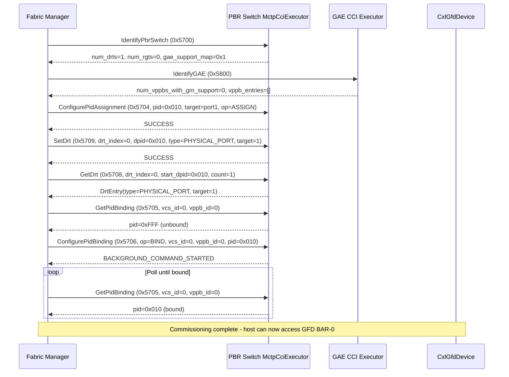
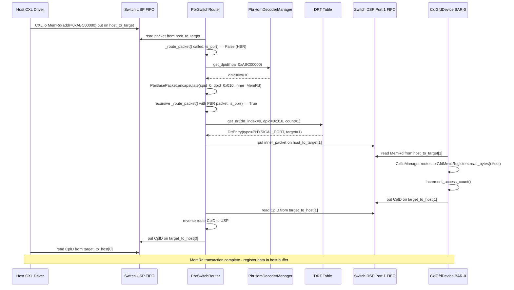
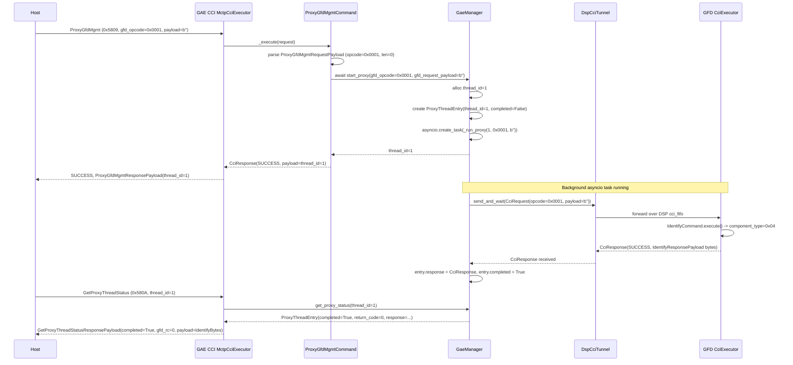
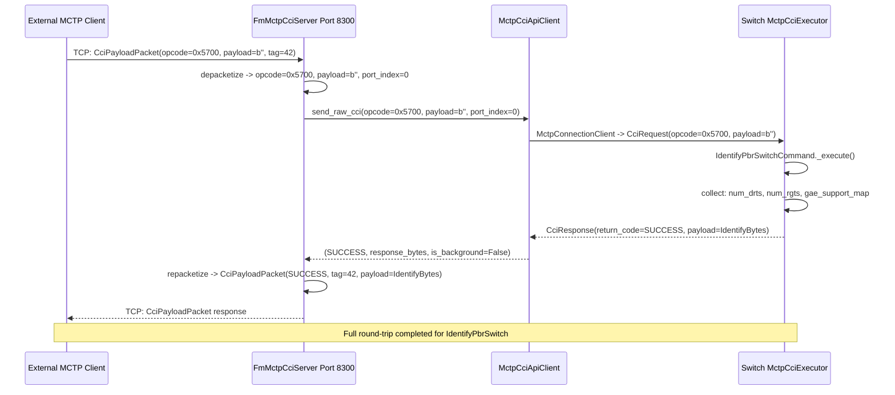
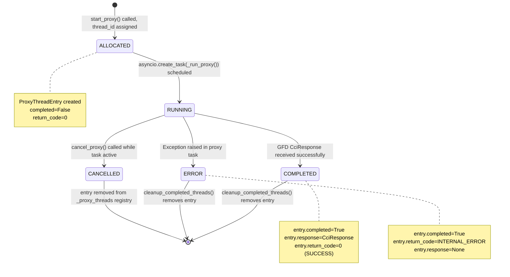
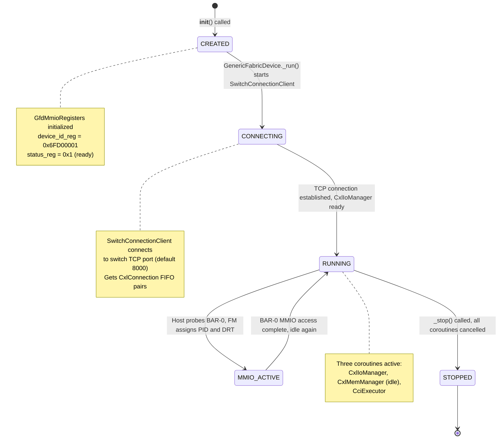
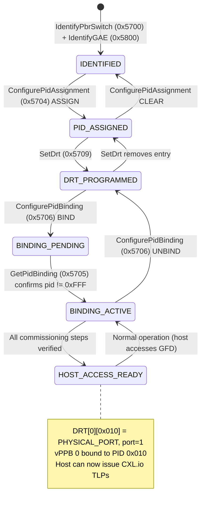

# GFD & GAE — Complete Design Document

**Version:** 1.0 | **Date:** May 2026 | **Status:** Implemented
**Spec:** CXL 4.0 Rev 1.0 §7.7.13 (GFD) and §7.7.14 (GAE)
**Authors:** OpenCIS Team
**Branch:** v0.5-dev

---

## Table of Contents

1. [Executive Summary](#1-executive-summary)
2. [System Architecture](#2-system-architecture)
3. [Control Plane — FM Commissioning](#3-control-plane--fm-commissioning)
4. [Data Plane — Packet Routing](#4-data-plane--packet-routing)
5. [GAE Proxy Flow](#5-gae-proxy-flow)
6. [Mermaid Sequence Diagrams](#6-mermaid-sequence-diagrams)
7. [Mermaid Class Diagram](#7-mermaid-class-diagram)
8. [Mermaid State Diagrams](#8-mermaid-state-diagrams)
9. [CCI Command Reference Table](#9-cci-command-reference-table)
10. [Unit Test Specification](#10-unit-test-specification)
11. [Traceability Matrix](#11-traceability-matrix)
12. [How to Test Without Host Drivers](#12-how-to-test-without-host-drivers)
13. [Remaining Data Plane Work](#13-remaining-data-plane-work)
14. [File Map](#14-file-map)

---

## 1. Executive Summary

### What is GFD?

A **Generic Fabric Device (GFD)** is a CXL 4.0 device type (§7.7.13) that attaches to a PBR (Port-Based Routing) switch via a Downstream Switch Port (DSP). Unlike a standard Single-Logical-Device (SLD), a GFD:

- Exposes **no CXL.mem** interface — it has no HDM (Host-Managed Device Memory) decoder and no coherent memory visible to the host.
- Exposes a **4 KB BAR-0** MMIO register space (GFD-specific registers for status, scratchpad, and telemetry) over CXL.io.
- Is identified by a CCI Identify response with `component_type = 0x04` (IdentifyComponentType.GFD).
- Is routed in the fabric by **PID (Port ID)**, not by BDF (Bus:Device:Function) or physical address.

In the opencis-core simulator, the GFD is implemented in `CxlGfdDevice` (`opencis/cxl/device/cxl_gfd_device.py`) and wrapped by the `GenericFabricDevice` application class (`opencis/apps/generic_fabric_device.py`) which manages the TCP connection to the switch.

### What is GAE?

A **Generic Access Endpoint (GAE)** is a logical function inside the PBR switch (§7.7.14) that:

- Owns a **list of virtual PPBs (vPPBs)**, each representing a GFD or G-FAM attachment point.
- Provides **CCI commands** (opcode range `0x58xx`) to the Fabric Manager (FM) for fabric commissioning.
- Implements an **asynchronous proxy mechanism** — the host cannot reach the GFD's CCI mailbox directly because the GFD sits behind the switch DSP. Instead, the GAE's `ProxyGfdMgmt` command (0x5809) tunnels any CCI command through to the GFD's executor and returns the result asynchronously via `GetProxyThreadStatus` (0x580A).

The GAE is implemented in `GaeManager` (`opencis/cxl/component/gae_manager.py`).

### What is GFA?

A **Generic Fabric-Attached** (GFA) system is the broader context: one or more GFDs attached to a PBR switch fabric, managed by a Fabric Manager, with the host accessing GFD MMIO registers over CXL.io TLPs routed by DPID (Destination PID) using the switch's DRT (Destination Routing Table). This document covers the GFD and GAE components of the GFA system.

### Why They Exist

Traditional CXL SLDs require HDM decoders, HPA→DPA address mapping, and coherent CXL.mem transactions — a heavyweight mechanism not suitable for lightweight accelerator or co-processor fabrics. The GFD/GFA model provides:

1. **Fabric-attached compute expansion** without HDM: accelerators, storage controllers, and co-processors can attach to the fabric and be discovered/managed via MMIO register reads over CXL.io, with no CXL.mem overhead.
2. **PID-based routing** instead of BDF-based routing: the switch routes TLPs to devices using DPIDs assigned by the FM, decoupling physical port assignment from host-visible configuration.
3. **Asynchronous management**: the GAE proxy mechanism allows the FM/host to issue CCI commands to GFDs that are not directly reachable, without blocking the switch fabric.

### Key Differences from SLD

| Dimension | Standard SLD | GFD |
|-----------|-------------|-----|
| CXL.mem | Yes (HDM) | No |
| HDM decoder | Yes | No (`hdm_count=0`) |
| CXL.cache | Yes (optional) | No (`cache_capable=0`) |
| config space | `mem_capable=1` | `mem_capable=0` |
| Routing | BDF / HPA | DPID / PID |
| BAR-0 | Device-specific | 4 KB `GfdMmioRegisters` |
| CCI Identify `component_type` | 0x00 (LD) | 0x04 (GFD) |
| FM commissioning | HDM decoder programming | PID assignment + DRT setup |

### Two Planes

This document covers both planes exhaustively:

- **Control Plane**: FM → Switch/GAE CCI commands over MCTP/TCP (port 8300) to commission the fabric: identify devices, assign PIDs, program DRT, bind vPPBs.
- **Data Plane**: Host → USP FIFO → PbrSwitchRouter → DSP FIFO → GFD device → MMIO register access → response TLP back to host. Packets are encapsulated in PBR wrappers carrying SPID/DPID for routing.

---

## 2. System Architecture

### 2.1 ASCII Architecture Diagram

```
┌────────────────────────────────────────────────────────────────────────────┐
│                          Host (Linux CXL Driver / QEMU)                    │
│                                                                            │
│   CXL.io TLP (MemRd / MemWr to BAR-0 address range)                       │
│   Config-space probe (BAR-0 size = 4 KB)                                  │
│   CXL.io Config-space read/write (BDF enumeration)                        │
└───────────────────────────────┬────────────────────────────────────────────┘
                                │  CXL.io TLPs (raw HBR — no PBR header yet)
                                ▼
┌────────────────────────────────────────────────────────────────────────────┐
│                              PBR Switch                                    │
│                                                                            │
│  ┌──────────────────────────────────────────────────────────────────────┐  │
│  │  USP (Upstream Switch Port — Host Edge)                              │  │
│  │   FifoPair:  host_to_target  ←── Host TLPs arrive here              │  │
│  │              target_to_host  ──► Host receives responses here        │  │
│  │                                                                      │  │
│  │   GAE CCI Executor (MctpCciExecutor)                                 │  │
│  │   ├─ IdentifyGaeCommand         (0x5800)                             │  │
│  │   ├─ GetPidAccessVectorsCommand (0x5802)                             │  │
│  │   ├─ ProxyGfdMgmtCommand        (0x5809) ──► GaeManager              │  │
│  │   ├─ GetProxyThreadStatusCommand(0x580A) ──► GaeManager              │  │
│  │   └─ CancelProxyThreadCommand   (0x580B) ──► GaeManager              │  │
│  └──────────────────────────┬───────────────────────────────────────────┘  │
│                             │                                              │
│  ┌──────────────────────────▼───────────────────────────────────────────┐  │
│  │  PbrSwitchRouter  (RunnableComponent)                                │  │
│  │                                                                      │  │
│  │  Ingress (host→device):  _process_port_host_ingress()               │  │
│  │    1. packet.is_pbr()? → No → HBR path:                             │  │
│  │       PbrHdmDecoderManager.get_dpid(address) → DPID                 │  │
│  │       PbrBasePacket.encapsulate(spid, dpid, inner_packet)            │  │
│  │    2. packet.is_pbr()? → Yes → PBR path:                            │  │
│  │       pbr_header.dpid → DRT lookup → egress port                    │  │
│  │       decapsulate inner_packet → put on egress FIFO                  │  │
│  │                                                                      │  │
│  │  Ingress (device→host):  _process_port_ingress()                    │  │
│  │    Reverse: PBR packet from DSP → DRT → USP host_to_target FIFO     │  │
│  │                                                                      │  │
│  │  ┌─────────────────────────────────────────────────────────────┐    │  │
│  │  │  PbrHdmDecoderManager                                       │    │  │
│  │  │    decoders: List[PbrHdmDecoder]                            │    │  │
│  │  │    get_dpid(hpa: int) → Optional[int]  (DPID)               │    │  │
│  │  └─────────────────────────────────────────────────────────────┘    │  │
│  │                                                                      │  │
│  │  ┌─────────────────────────────────────────────────────────────┐    │  │
│  │  │  DRT (Destination Routing Table)  — via PbrSwitchManager    │    │  │
│  │  │    get_drt(drt_index, dpid, count) → DrtEntry               │    │  │
│  │  │    DrtEntry: {type=PHYSICAL_PORT, target=port_index}         │    │  │
│  │  └─────────────────────────────────────────────────────────────┘    │  │
│  └──────────────────────────┬───────────────────────────────────────────┘  │
│                             │  Egress: inner_packet → port_fifos[1]        │
│                             │                                              │
│  ┌──────────────────────────▼───────────────────────────────────────────┐  │
│  │  DSP Port 1 (Downstream Switch Port — GFD edge)                      │  │
│  │   FifoPair:  host_to_target  ──► GFD receives TLPs                  │  │
│  │              target_to_host  ←── GFD sends response TLPs            │  │
│  └──────────────────────────┬───────────────────────────────────────────┘  │
└────────────────────────────────────────────────────────────────────────────┘
                              │  TCP (SwitchConnectionClient)
                              ▼
┌────────────────────────────────────────────────────────────────────────────┐
│                           CxlGfdDevice                                     │
│                                                                            │
│  ┌─────────────────────┐   ┌──────────────────────────────────────────┐   │
│  │  GfdMmioRegisters   │   │  CxlIoManager                            │   │
│  │  (BAR-0, 4 KB)      │◄──│  Receives MemRd / MemWr TLPs             │   │
│  │                     │   │  Routes to GfdMmioRegisters              │   │
│  │  0x000 device_id    │   │  Returns CplD (completion w/ data)       │   │
│  │  0x008 scratchpad_0 │   └──────────────────────────────────────────┘   │
│  │  0x010 scratchpad_1 │                                                   │
│  │  0x018 scratchpad_2 │   ┌──────────────────────────────────────────┐   │
│  │  0x020 scratchpad_3 │   │  CciExecutor                             │   │
│  │  0x028 status_reg   │   │  IdentifyCommand (0x0001)                │   │
│  │  0x02C control_reg  │   │    → component_type = 0x04 (GFD)         │   │
│  │  0x030 access_count │   └──────────────────────────────────────────┘   │
│  │  0x038-0xFFF rsvd   │                                                   │
│  └─────────────────────┘   ┌──────────────────────────────────────────┐   │
│                             │  CxlMemManager  (idle stub)              │   │
│                             │  No HDM, no CXL.mem traffic              │   │
│                             └──────────────────────────────────────────┘   │
│                                                                            │
│  PCI Identity:                                                             │
│    vendor_id   = EEUM_VID                                                  │
│    device_id   = SW_GFD_DID                                                │
│    class_code  = PCI_CLASS.MEMORY_CONTROLLER                               │
│    BAR-0       = 64-bit, non-prefetchable, size = 4 KB (0x1000)            │
│    config_space= CxlType3SldConfigSpace(cache_capable=0, mem_capable=0,   │
│                                          hdm_count=0)                      │
└────────────────────────────────────────────────────────────────────────────┘

┌────────────────────────────────────────────────────────────────────────────┐
│                         Fabric Manager (FM)                                │
│                                                                            │
│  MCTP/TCP port 8300 → FmMctpCciServer → MctpCciApiClient                  │
│  SocketIO port 8200  (optional dashboard / event bus)                      │
│                                                                            │
│  PBR Switch Commands (0x57xx):                                             │
│    IdentifyPbrSwitch   (0x5700) — discover switch capabilities             │
│    FabricCrawlOut      (0x5701) — tunnel raw CCI to GFD DSP port           │
│    ConfigurePidAssign  (0x5704) — assign PID→port mapping                  │
│    GetPidBinding       (0x5705) — query vPPB→PID binding                   │
│    ConfigurePidBinding (0x5706) — bind/unbind vPPB to PID (BACKGROUND)     │
│    GetDrt              (0x5708) — read DRT entries                         │
│    SetDrt              (0x5709) — write DRT entries                        │
│                                                                            │
│  GAE Commands (0x58xx):                                                    │
│    IdentifyGAE             (0x5800) — discover vPPB list                   │
│    GetPidAccessVectors     (0x5802) — query access vectors for a PID       │
│    ProxyGfdMgmt            (0x5809) — proxy CCI to GFD (BACKGROUND)        │
│    GetProxyThreadStatus    (0x580A) — poll proxy thread completion         │
│    CancelProxyThread       (0x580B) — cancel active proxy thread           │
└────────────────────────────────────────────────────────────────────────────┘

┌────────────────────────────────────────────────────────────────────────────┐
│                    GaeManager (inside PBR Switch)                          │
│                                                                            │
│  _vppbs: List[GaeVppbInfo]           ← FM-visible vPPB table              │
│  _gfd_tunnel: DspCciTunnel           ← spec-correct tunnel (production)   │
│  _gfd_executor: CciExecutor          ← direct executor (unit test only)    │
│  _proxy_threads: Dict[int, ProxyThreadEntry]  ← live thread registry      │
│  _next_thread_id: int                ← monotonic counter                   │
│                                                                            │
│  GaeVppbInfo:                                                              │
│    vppb_id: int                                                            │
│    global_memory_support: bool                                             │
│    pid: int = 0xFFF  (0xFFF = unbound)                                    │
│                                                                            │
│  ProxyThreadEntry:                                                         │
│    thread_id: int                                                          │
│    gfd_opcode: int                                                         │
│    task: asyncio.Task                                                      │
│    response: CciResponse                                                   │
│    completed: bool                                                         │
│    return_code: int                                                        │
└────────────────────────────────────────────────────────────────────────────┘
```

### 2.2 PBR Packet Wire Format

```
 Byte  0    1    2    3    4    5   ...
      ┌────┬────┬────────────────────────────────────────────────────┐
      │ SystemHeader (2B) │ PbrHeader (4B)     │ Inner Packet (N B)  │
      │  payload_type=5   │ spid[11:0]         │ CXL.io TLP bytes    │
      │                   │ dpid[23:12]        │ (MemRd/MemWr/CplD)  │
      │                   │ reserved[31:24]    │                     │
      └───────────────────┴────────────────────┴─────────────────────┘

  PbrHeader field layout (little-endian 32-bit word):
    bits  [11: 0]  = spid   (Source PID, 12 bits)
    bits  [23:12]  = dpid   (Destination PID, 12 bits)
    bits  [31:24]  = reserved (8 bits)
```

### 2.3 GFD BAR-0 Register Map

| Offset | Size | Name | Attr | Default | Description |
|--------|------|------|------|---------|-------------|
| 0x000 | 8 B | `device_id_reg` | HW_INIT | `0x6FD00001` | GFD identification sentinel |
| 0x008 | 8 B | `scratchpad_0` | R/W | 0 | General-purpose 64-bit scratchpad |
| 0x010 | 8 B | `scratchpad_1` | R/W | 0 | General-purpose 64-bit scratchpad |
| 0x018 | 8 B | `scratchpad_2` | R/W | 0 | General-purpose 64-bit scratchpad |
| 0x020 | 8 B | `scratchpad_3` | R/W | 0 | General-purpose 64-bit scratchpad |
| 0x028 | 4 B | `status_reg` | HW_INIT | `0x00000001` | Bit-0: device ready |
| 0x02C | 4 B | `control_reg` | R/W | 0 | Bit-0: reset request |
| 0x030 | 8 B | `mmio_access_count` | R/W | 0 | Running count of MMIO accesses served |
| 0x038–0xFFF | 4040 B | `reserved` | RESERVED | 0 | Zero-filled pad to 4 KB |

**Notes:**
- `HW_INIT` fields are written once at boot by firmware; subsequently read-only to the host via the bitmask enforced by `BitMaskedBitStructure`.
- `mmio_access_count` is incremented by `GfdMmioRegisters.increment_access_count()` every time the device serves an MMIO request. This makes it a firmware-writable telemetry counter.
- `GFD_BAR_SIZE = 0x1000` (4096 bytes), defined in `gfd_mmio_registers.py`.
- `GFD_DEVICE_ID_SENTINEL = 0x6FD00001` — chosen so FM/debug tools can fingerprint the BAR at a glance.

---

## 3. Control Plane — FM Commissioning

The FM must execute the following 9-step commissioning sequence before the host can access the GFD's BAR-0. Each step uses a specific CCI command sent over MCTP/TCP to the switch's `MctpCciExecutor`.

### Step 1 — Identify PBR Switch (0x5700)

**Command:** `IdentifyPbrSwitchCommand`
**Direction:** FM → Switch
**Function called:** `IdentifyPbrSwitchCommand._execute()`

The FM sends `IdentifyPbrSwitch` to discover switch capabilities. The response includes:
- `num_drts`: number of DRT tables (typically 1)
- `num_rgts`: number of RGT tables (typically 0 for simple configs)
- `gae_support_map`: bitmask indicating which ports have GAE capabilities

**Purpose:** Allows the FM to know how many DRTs are available for programming and whether GAE is present. In the simulator, `num_drts=1`, `num_rgts=0`, `gae_support_map=0x1` (port 0 / USP supports GAE).

### Step 2 — Identify GAE (0x5800)

**Command:** `IdentifyGaeCommand`
**Direction:** FM → Switch (GAE CCI executor at USP)
**Function called:** `IdentifyGaeCommand._execute()` → `GaeManager.get_vppbs()`

The FM sends `IdentifyGAE` to the GAE executor. The response is `IdentifyGaeResponsePayload`:
- `num_vppbs_with_gm_support`: number of vPPBs with G-FAM (Global Memory) support
- `vppb_entries`: list of `VppbGlobalMemorySupportInfo` (4 bytes each: `vppb_id`, `global_memory_support` bit)

For a simple GFD-only configuration, `num_vppbs_with_gm_support = 0`, `vppb_entries = []`.

**Purpose:** Allows the FM to enumerate vPPBs and their G-FAM capabilities before commissioning begins.

### Step 3 — Configure PID Assignment (0x5704)

**Command:** `ConfigurePidAssignmentCommand`
**Direction:** FM → Switch
**Function called:** `assign_pid(pid=0x010, target_id=port1)`

The FM assigns PID `0x010` to physical DSP port 1 (where the GFD is connected). This creates the PID→port mapping in the switch's PID assignment table.

**Parameters:**
- `pid`: 12-bit PID value (0x010 in typical commissioning, must not be 0xFFF which is the unbound sentinel)
- `target_id`: physical port index (1 for DSP port 1)
- `operation`: ASSIGN

**Purpose:** Creates the logical PID that the router will use to address the GFD. Before this step, no PID is associated with DSP port 1.

### Step 4 — Set DRT (0x5709)

**Command:** `SetDrtCommand`
**Direction:** FM → Switch
**Function called:** `set_drt(drt_index=0, dpid=0x010, entry_type=PHYSICAL_PORT, target=1)`

The FM programs DRT table 0, entry for DPID `0x010`, with:
- `entry_type = PHYSICAL_PORT` — route to a specific physical port
- `target = 1` — port index 1 (DSP port where GFD is attached)

**Purpose:** After this step, the PBR switch knows how to route packets with `DPID=0x010` — they go to DSP port 1. This is the critical forwarding-plane programming step.

### Step 5 — Get DRT (0x5708)

**Command:** `GetDrtCommand`
**Direction:** FM → Switch
**Function called:** `get_drt(drt_index=0, start_dpid=0x010, count=1)`

The FM reads back the DRT entry just written to verify it was programmed correctly. Expected response: `DrtEntry(type=PHYSICAL_PORT, target=1)`.

**Purpose:** Verification / idempotency check. In production the FM may skip this, but it is recommended for initial commissioning validation.

### Step 6 — Get PID Binding (0x5705) — Verify Unbound

**Command:** `GetPidBindingCommand`
**Direction:** FM → Switch
**Function called:** `get_pid_binding(vcs_id=0, vppb_id=0)`

The FM queries whether vPPB 0 is already bound to a PID. The expected response is `pid = 0xFFF` (the unbound sentinel).

**Purpose:** Ensures the vPPB is in a clean state before binding. If the response is not `0xFFF`, the FM must unbind the existing PID first.

### Step 7 — Configure PID Binding (0x5706) — BIND

**Command:** `ConfigurePidBindingCommand`
**Direction:** FM → Switch
**Function called:** `ConfigurePidBindingCommand._execute()` → background task started

**Parameters:**
- `operation`: BIND
- `vcs_id`: 0
- `vppb_id`: 0
- `pid`: 0x010

This is a **background command** — the switch returns `BACKGROUND_COMMAND_STARTED` immediately and the binding operation completes asynchronously. The FM must poll or wait before using the binding.

**Purpose:** Associates vPPB 0 with PID `0x010`. After this binding, the host can discover vPPB 0 in the CXL topology and the router will route packets to GFD.

### Step 8 — Get PID Binding (0x5705) — Verify Bound

**Command:** `GetPidBindingCommand`
**Direction:** FM → Switch
**Function called:** `get_pid_binding(vcs_id=0, vppb_id=0)`

The FM polls until the binding is confirmed: `pid = 0x010` (no longer `0xFFF`).

**Purpose:** Confirms the background binding completed successfully. The FM may retry this step until the binding is confirmed or a timeout expires.

### Step 9 — Host Access Ready

After step 8, the fabric is fully commissioned:
- DRT[0][0x010] → PHYSICAL_PORT, target=1 (switch knows where to send packets)
- vPPB 0 bound to PID 0x010 (host enumeration can discover the GFD)
- GFD device is running (`CxlGfdDevice._run()` coroutines active)

The host can now:
1. Send CXL.io Config-space transactions to enumerate the GFD (BAR-0 size = 4 KB returned)
2. Map BAR-0 and issue `MemRd` / `MemWr` TLPs to the GFD MMIO registers
3. Issue CCI commands via the GAE proxy (`ProxyGfdMgmt`) to manage the GFD

---

## 4. Data Plane — Packet Routing

### Flow A: Host → GFD (HBR → PBR Encapsulation)

This flow describes how a host `MemRd` to GFD BAR-0 address `0xABC00000` traverses the switch fabric.

**Step 1:** Host CXL driver issues a `MemRd` TLP to address `0xABC00000` (mapped to GFD BAR-0 by the OS during PCI enumeration). The TLP is a raw CXL.io packet — it contains no PBR header (this is called an **HBR** — Host-Based Routing — packet).

**Step 2:** The TLP arrives at the switch **USP FIFO** `host_to_target` queue. The `PbrSwitchRouter` monitors this queue via `_process_port_host_ingress(ingress_port_id=0, fifo)`.

**Step 3:** `PbrSwitchRouter._process_port_host_ingress()` reads the packet from `fifo.host_to_target` and calls `_route_packet(ingress_port_id=0, packet, egress_direction=HOST_TO_TARGET)`.

**Step 4:** Inside `_route_packet()`: `packet.is_pbr()` is checked → returns `False` because the packet has `system_header.payload_type != SYSTEM_PAYLOAD_TYPE.PBR`. This is the HBR path.

**Step 5:** The router extracts the destination address from the `CxlIoMemReqPacket`: `address = packet.get_address()` → `0xABC00000`.

**Step 6:** `PbrHdmDecoderManager.get_dpid(0xABC00000)` is called. The HDM decoder manager iterates through its registered `PbrHdmDecoder` instances. Each decoder holds a base address + size range and a `target_dpid`. The decoder whose range covers `0xABC00000` returns `dpid = 0x010`.

**Step 7:** `PbrBasePacket.encapsulate(spid=0, dpid=0x010, inner_packet=tlp)` is called. This:
- Serializes `tlp` to bytes via `bytes(inner_packet)`
- Creates a new `PbrBasePacket` with `system_header.payload_type = SYSTEM_PAYLOAD_TYPE.PBR`
- Sets `pbr_header.spid = 0` (USP port index), `pbr_header.dpid = 0x010`
- Stashes the original packet object as `pkt._inner_packet` to avoid re-parsing

**Step 8:** `_route_packet()` is called recursively with the new PBR packet. Now `packet.is_pbr()` → `True`. The PBR path is taken.

**Step 9:** `pbr_switch_manager.get_drt(drt_index=0, dpid=0x010, count=1)` is called → returns `DrtEntry(type=PHYSICAL_PORT, target=1)`. Egress port = 1.

**Step 10:** The inner packet is decapsulated (`pkt._inner_packet` or re-parsed from PBR payload bytes) and placed on `port_fifos[1].host_to_target` queue. DSP port 1 now has the original CXL.io MemRd packet.

**Step 11:** `CxlGfdDevice._cxl_io_manager` (running `CxlIoManager` coroutine) reads the packet from the FIFO. It identifies the offset into BAR-0: `offset = address - bar_base_address`. It delegates to `GfdMmioRegisters` for the actual register read.

**Step 12:** `GfdMmioRegisters` performs `read_bytes(offset, offset+size-1)` using the `BitMaskedBitStructure` read path. It calls `increment_access_count()` to update the telemetry counter. Returns the register data bytes.

**Step 13:** `CxlIoManager` constructs a `CplD` (Completion with Data) TLP containing the register bytes and places it on `port_fifos[1].target_to_host` (the DSP-side egress back toward the switch).

**Step 14:** `PbrSwitchRouter._process_port_ingress(ingress_port_id=1)` reads the `CplD` from `port_fifos[1].target_to_host`. Reverse routing: the PBR SPID from the outgoing packet tells the router to send the response to USP. The response is placed on `port_fifos[0].target_to_host`.

**Step 15:** The host reads the `CplD` from the USP FIFO and the `MemRd` transaction completes. The register data is now in the host's read buffer.

---

### Flow B: GFD → Host (PBR Reverse Path)

This describes how a GFD-initiated response (or in future: a GFD-initiated interrupt/event) returns to the host.

**Step 1:** The GFD has a `CplD` (completion with data) ready to send. It is placed on `port_fifos[1].target_to_host` (DSP port 1, device-to-switch direction). This happens as part of `CxlIoManager` processing a completed MemRd.

**Step 2:** `PbrSwitchRouter._process_port_ingress(ingress_port_id=1, fifo=port_fifos[1])` reads from `fifo.target_to_host`.

**Step 3:** `_route_packet(ingress_port_id=1, packet=CplD, egress_direction=TARGET_TO_HOST)` is called. `packet.is_pbr()` → `False` for a raw CXL.io `CplD` response. This is the device→switch direction.

**Step 4:** For device→switch direction, the router must determine where to send the completion. CXL.io completions use the Requester ID (BDF) embedded in the `CplD` TLP header. The router looks up the Requester ID to find the egress USP port.

**Step 5:** The `CplD` is wrapped in a PBR packet with `spid = 1` (DSP port 1, the GFD's port) and `dpid = 0` (the USP port / host), then encapsulated: `PbrBasePacket.encapsulate(spid=1, dpid=0, inner_packet=CplD)`.

**Step 6:** The PBR packet is routed: `get_drt(0, 0x000, 1)` → `DrtEntry(PHYSICAL_PORT, target=0)` (USP). Inner packet is decapsulated and placed on `port_fifos[0].target_to_host`.

**Step 7:** The host reads the `CplD` from the USP `target_to_host` FIFO. The MemRd transaction completes on the host side.

---

## 5. GAE Proxy Flow

The GAE proxy mechanism allows the host to issue CCI commands to the GFD even though the GFD has no direct host-visible CCI mailbox. The mechanism is fully asynchronous: the command is started in the background and the host polls for completion.

### Full 6-Step Proxy Flow

**Step 1 — Host issues ProxyGfdMgmt (0x5809):**
The host (or FM) constructs a `ProxyGfdMgmtRequestPayload`:
```
gfd_opcode = 0x0001  (IdentifyGFD)
gfd_payload_len = 0
gfd_payload = b''
```
Wire bytes: `\x01\x00\x00\x00` (4 bytes: opcode LE, payload_len LE).
This is sent to the GAE's CCI executor at the USP.

**Step 2 — GAE receives and dispatches:**
`ProxyGfdMgmtCommand._execute(request)` is called:
- Parses `ProxyGfdMgmtRequestPayload` from `request.payload`
- Checks `gae_manager.get_gfd_executor() is not None` (executor or tunnel must be bound)
- Calls `await gae_manager.start_proxy(gfd_opcode=0x0001, gfd_request_payload=b'')`

**Step 3 — GaeManager starts proxy task:**
`GaeManager.start_proxy()`:
- Allocates a new `thread_id` via monotonic counter (`_next_thread_id += 1`)
- Creates a `ProxyThreadEntry(thread_id=N, gfd_opcode=0x0001, completed=False)`
- Registers it in `_proxy_threads[N]`
- Creates `asyncio.Task` that calls the GFD executor:
  - If `_gfd_tunnel` is bound (production): `gfd_tunnel.send_and_wait(CciRequest(opcode=0x0001, payload=b''))`
  - If `_gfd_executor` is bound (test): `gfd_executor.execute_command(CciRequest(opcode=0x0001))`
- Returns `thread_id = N`

**Step 4 — BACKGROUND_COMMAND_STARTED returned to host:**
`ProxyGfdMgmtCommand._execute()` receives `thread_id = N` from `start_proxy()`.
Constructs response: `ProxyGfdMgmtResponsePayload(thread_id=N)` → 2-byte payload `\xNN\x00`.
Returns `CciResponse(return_code=SUCCESS, payload=thread_id_bytes)`.

> **Note:** Despite the command docstring saying `BACKGROUND_COMMAND_STARTED`, the actual implementation in `proxy_gfd_mgmt.py` returns `CCI_RETURN_CODE.SUCCESS` (0x0000) with the `thread_id` in the response payload. The background nature is tracked via the `thread_id` polling mechanism rather than via the `bo_flag` in the CCI response header. The host must use the returned `thread_id` to poll for completion.

**Step 5 — Background task executes:**
The asyncio task runs concurrently:
1. Builds `CciRequest(opcode=0x0001, payload=b'')`
2. Sends via `_gfd_tunnel` (TCP → switch DSP cci_fifo → GFD) or directly via `_gfd_executor`
3. GFD processes `IdentifyCommand` → returns `IdentifyResponsePayload(component_type=GFD=0x04)`
4. Task stores result: `entry.response = CciResponse(return_code=SUCCESS, payload=identify_bytes)`
5. Sets `entry.completed = True`, `entry.return_code = 0` (SUCCESS)

**Step 6 — Host polls GetProxyThreadStatus (0x580A):**
Host sends `GetProxyThreadStatusRequestPayload(thread_id=N)` (2 bytes: `\xNN\x00`).
`GetProxyThreadStatusCommand._execute()`:
- Calls `gae_manager.get_proxy_status(N)` → returns `ProxyThreadEntry`
- If `entry.completed`:
  - `gfd_resp_bytes = entry.response.payload`
  - Returns `GetProxyThreadStatusResponsePayload(thread_id=N, completed=True, gfd_return_code=0, gfd_response_payload=identify_bytes)`
- If not yet completed:
  - Returns `GetProxyThreadStatusResponsePayload(thread_id=N, completed=False, gfd_return_code=0, gfd_response_payload=b'')`

**Wire format of GetProxyThreadStatus response (8-byte header + payload):**
```
Byte 0x00-0x01: thread_id  (LE uint16)
Byte 0x02:      status     (bit 0 = completed)
Byte 0x03:      reserved
Byte 0x04-0x05: gfd_return_code (LE uint16)
Byte 0x06-0x07: reserved
Byte 0x08+:     gfd_response_payload (variable length)
```

---

## 6. Mermaid Sequence Diagrams

### 6a. FM Commissioning — Full 9-Step Sequence



### 6b. Data Plane TLP Routing — Host to GFD



### 6c. GAE Proxy Command Flow — Host Proxies IdentifyGFD



### 6d. MCTP Port 8300 → Switch CCI Command Forwarding



---

## 7. Mermaid Class Diagram

```mermaid
classDiagram
    class RunnableComponent {
        +run()
        +stop()
        +wait_for_ready()
        #_run()
        #_stop()
        #_change_status_to_running()
    }

    class GenericFabricDevice {
        -_test_mode: bool
        -_sw_conn_client: SwitchConnectionClient
        -_cxl_connection: CxlConnection
        -_gfd_device: CxlGfdDevice
        +get_gfd_device() CxlGfdDevice
        +_run()
        +_stop()
    }

    class CxlGfdDevice {
        -_port_index: int
        -_serial_number: str
        -_gfd_registers: GfdMmioRegisters
        -_cci_executor: CciExecutor
        -_cxl_io_manager: CxlIoManager
        -_cxl_mem_manager: CxlMemManager
        +get_registers() GfdMmioRegisters
        +get_bar_size() int
        +_run()
    }

    class GfdMmioRegisters {
        +GFD_BAR_SIZE: int = 4096
        +GFD_DEVICE_ID_SENTINEL: int
        -_SCRATCHPAD_OFFSETS: List
        -_ACCESS_COUNT_OFFSET: int
        +get_scratchpad(index) int
        +set_scratchpad(index, value)
        +increment_access_count()
    }

    class GaeManager {
        -_vppbs: List[GaeVppbInfo]
        -_label: str
        -_gfd_tunnel: DspCciTunnel
        -_gfd_executor: CciExecutor
        -_proxy_threads: Dict[int, ProxyThreadEntry]
        -_next_thread_id: int
        +set_gfd_tunnel(tunnel)
        +set_gfd_executor(executor)
        +get_gfd_executor() CciExecutor
        +get_vppb_count() int
        +get_vppbs() List[GaeVppbInfo]
        +start_proxy(gfd_opcode, gfd_request_payload) int
        +get_proxy_status(thread_id) ProxyThreadEntry
        +cancel_proxy(thread_id) CCI_RETURN_CODE
        +cleanup_completed_threads()
    }

    class GaeVppbInfo {
        +vppb_id: int
        +global_memory_support: bool
        +pid: int = 0xFFF
    }

    class ProxyThreadEntry {
        +thread_id: int
        +gfd_opcode: int
        +task: asyncio.Task
        +response: CciResponse
        +completed: bool
        +return_code: int
    }

    class PbrSwitchRouter {
        -_switch_id: int
        -_port_fifos: List[FifoPair]
        -_pbr_switch_manager: PbrSwitchManager
        -_hdm_decoder_manager: PbrHdmDecoderManager
        -_port_types: List[bool]
        +_process_port_ingress(port_id, fifo)
        +_process_port_host_ingress(port_id, fifo)
        +_route_packet(port_id, packet, direction)
    }

    class PbrBasePacket {
        +pbr_header: PbrHeader
        +create(spid, dpid, data) PbrBasePacket
        +encapsulate(spid, dpid, inner_packet) PbrBasePacket
        +is_pbr() bool
    }

    class PbrHdmDecoderManager {
        -_decoders: List[PbrHdmDecoder]
        +get_dpid(hpa: int) Optional[int]
        +commit(index, info) bool
    }

    class PbrHdmDecoder {
        +target_dpids: List[int]
        +get_dpid(hpa: int) int
    }

    class CciForegroundCommand {
        +OPCODE: int
        +execute(request) CciResponse
        #_execute(request) CciResponse
        +get_opcode() int
    }

    class IdentifyGaeCommand {
        +OPCODE: int = 0x5800
        -_gae_manager: GaeManager
        +create_cci_request() CciRequest
        +parse_response_payload(data) IdentifyGaeResponsePayload
    }

    class ProxyGfdMgmtCommand {
        +OPCODE: int = 0x5809
        -_gae_manager: GaeManager
        +create_cci_request(gfd_opcode, gfd_payload) CciRequest
        +parse_response_payload(data) ProxyGfdMgmtResponsePayload
    }

    class GetProxyThreadStatusCommand {
        +OPCODE: int = 0x580A
        -_gae_manager: GaeManager
        +create_cci_request(thread_id) CciRequest
        +parse_response_payload(data) GetProxyThreadStatusResponsePayload
    }

    class CancelProxyThreadCommand {
        +OPCODE: int = 0x580B
        -_gae_manager: GaeManager
        +create_cci_request(thread_id) CciRequest
    }

    class GetPidAccessVectorsCommand {
        +OPCODE: int = 0x5802
        -_gae_manager: GaeManager
    }

    RunnableComponent <|-- GenericFabricDevice
    RunnableComponent <|-- CxlGfdDevice
    RunnableComponent <|-- PbrSwitchRouter
    GenericFabricDevice *-- CxlGfdDevice
    GenericFabricDevice *-- SwitchConnectionClient
    CxlGfdDevice *-- GfdMmioRegisters
    CxlGfdDevice *-- CciExecutor
    CxlGfdDevice *-- CxlIoManager
    CxlGfdDevice *-- CxlMemManager
    GaeManager *-- GaeVppbInfo
    GaeManager *-- ProxyThreadEntry
    PbrSwitchRouter --> PbrSwitchManager
    PbrSwitchRouter --> PbrHdmDecoderManager
    PbrSwitchRouter --> PbrBasePacket
    PbrHdmDecoderManager *-- PbrHdmDecoder
    CciForegroundCommand <|-- IdentifyGaeCommand
    CciForegroundCommand <|-- GetProxyThreadStatusCommand
    CciForegroundCommand <|-- CancelProxyThreadCommand
    CciForegroundCommand <|-- GetPidAccessVectorsCommand
    CciForegroundCommand <|-- ProxyGfdMgmtCommand
    IdentifyGaeCommand --> GaeManager
    ProxyGfdMgmtCommand --> GaeManager
    GetProxyThreadStatusCommand --> GaeManager
    CancelProxyThreadCommand --> GaeManager
    GetPidAccessVectorsCommand --> GaeManager
```



---

## 8. Mermaid State Diagrams

### 8a. GaeManager Proxy Thread Lifecycle



### 8b. GFD Device Lifecycle



### 8c. FM Commissioning State Machine



---

## 9. CCI Command Reference Table

| Opcode | Command Name | Handler Class | Direction | Input Payload | Output Payload | Background | Spec Ref |
|--------|-------------|--------------|-----------|---------------|----------------|------------|----------|
| 0x0001 | Identify | `IdentifyCommand` | FM→GFD via GAE proxy | none | `IdentifyResponsePayload` (`component_type=0x04`) | No | §8.2.9.1 |
| 0x5700 | IdentifyPbrSwitch | `IdentifyPbrSwitchCommand` | FM→Switch | none | `num_drts`, `num_rgts`, `gae_support_map` | No | §7.7.13.1 |
| 0x5701 | FabricCrawlOut | `FabricCrawlOutCommand` | FM→Switch | `target_port`, `gfd_opcode`, `gfd_payload` | `gfd_response` bytes | No | §7.7.13.2 |
| 0x5704 | ConfigurePidAssignment | `ConfigurePidAssignmentCommand` | FM→Switch | `pid`, `target_id`, `operation` | none | No | §7.7.13.5 |
| 0x5705 | GetPidBinding | `GetPidBindingCommand` | FM→Switch | `vcs_id`, `vppb_id` | `pid` (`0xFFF`=unbound) | No | §7.7.13.6 |
| 0x5706 | ConfigurePidBinding | `ConfigurePidBindingCommand` | FM→Switch | `operation`, `vcs_id`, `vppb_id`, `pid` | none | **YES** | §7.7.13.7 |
| 0x5708 | GetDrt | `GetDrtCommand` | FM→Switch | `drt_index`, `start_dpid`, `count` | `List[DrtEntry]` | No | §7.7.13.9 |
| 0x5709 | SetDrt | `SetDrtCommand` | FM→Switch | `drt_index`, `entries` | none | No | §7.7.13.10 |
| 0x5800 | IdentifyGAE | `IdentifyGaeCommand` | FM/Host→GAE | none | `num_vppbs_with_gm_support`, `vppb_entries[]` | No | §7.7.14.1 |
| 0x5802 | GetPidAccessVectors | `GetPidAccessVectorsCommand` | FM→GAE | `pid` | `access_vector_bitmap` | No | §7.7.14.3 |
| 0x5809 | ProxyGfdMgmt | `ProxyGfdMgmtCommand` | Host→GAE | `gfd_opcode` (2B), `gfd_payload_len` (2B), `gfd_payload` (N B) | `thread_id` (2B) | **YES** | §7.7.14.10 |
| 0x580A | GetProxyThreadStatus | `GetProxyThreadStatusCommand` | Host→GAE | `thread_id` (2B) | `thread_id`, `completed` bit, `gfd_return_code`, `gfd_response_payload` | No | §7.7.14.11 |
| 0x580B | CancelProxyThread | `CancelProxyThreadCommand` | Host→GAE | `thread_id` (2B) | none | No | §7.7.14.12 |

### Wire Format Details

**ProxyGfdMgmt Request (0x5809):**
```
Byte 0x00-0x01: gfd_opcode         (uint16 LE)
Byte 0x02-0x03: gfd_payload_length (uint16 LE)
Byte 0x04+:     gfd_payload        (variable, length bytes)
```

**ProxyGfdMgmt Response:**
```
Byte 0x00-0x01: thread_id (uint16 LE)
```

**GetProxyThreadStatus Request (0x580A):**
```
Byte 0x00-0x01: thread_id (uint16 LE)
```

**GetProxyThreadStatus Response:**
```
Byte 0x00-0x01: thread_id          (uint16 LE, echoed)
Byte 0x02:      status             (bit 0 = completed)
Byte 0x03:      reserved
Byte 0x04-0x05: gfd_return_code    (uint16 LE, valid if completed)
Byte 0x06-0x07: reserved
Byte 0x08+:     gfd_response_payload (variable, present if completed)
```

**CancelProxyThread Request (0x580B):**
```
Byte 0x00-0x01: thread_id (uint16 LE)
```
**CancelProxyThread Response:** empty (return code only in CCI header)

**IdentifyGAE Response (0x5800):**
```
Byte 0x00-0x01: num_vppbs_with_gm_support (uint16 LE)
Byte 0x02-0x03: reserved
Byte 0x04+:     vPPB entries (4 bytes each):
                  Byte 0: vppb_id
                  Byte 1: global_memory_support (bit 0)
                  Byte 2-3: reserved
```

---

## 10. Unit Test Specification

### 10.1 Test Case Table

| Test ID | Test Name | Component | What it Tests | Input | Expected Output |
|---------|-----------|-----------|---------------|-------|-----------------|
| GM-001 | `test_start_proxy_with_executor` | GaeManager | start_proxy when executor is bound | gfd_opcode=0x0001, payload=b'' | Returns thread_id >= 1 |
| GM-002 | `test_start_proxy_with_tunnel` | GaeManager | start_proxy when tunnel is bound (tunnel takes precedence) | gfd_opcode=0x0001, payload=b'' | Returns thread_id, tunnel.send_and_wait called |
| GM-003 | `test_start_proxy_no_binding` | GaeManager | start_proxy when neither tunnel nor executor bound | gfd_opcode=0x0001 | Returns 0 (error) |
| GM-004 | `test_get_proxy_status_completed` | GaeManager | get_proxy_status when thread has completed | thread_id of completed task | ProxyThreadEntry(completed=True) |
| GM-005 | `test_get_proxy_status_pending` | GaeManager | get_proxy_status while thread still running | thread_id of running task | ProxyThreadEntry(completed=False) |
| GM-006 | `test_cancel_proxy_active` | GaeManager | cancel_proxy while task is active | thread_id of running task | CCI_RETURN_CODE.SUCCESS, task.cancel() called |
| GM-007 | `test_cancel_proxy_completed` | GaeManager | cancel_proxy on already-completed thread (idempotent) | thread_id of completed task | CCI_RETURN_CODE.SUCCESS (no-op) |
| GM-008 | `test_cancel_proxy_unknown_id` | GaeManager | cancel_proxy with nonexistent thread_id | thread_id=9999 | CCI_RETURN_CODE.INVALID_INPUT |
| GM-009 | `test_cleanup_completed_threads` | GaeManager | cleanup_completed_threads removes finished entries | 2 completed + 1 running thread | 1 running thread remains after cleanup |
| GM-010 | `test_vppb_list_access` | GaeManager | get_vppbs returns correct list | GaeVppbInfo(vppb_id=0, global_memory_support=True) | List matches constructor input |
| GFD-001 | `test_gfd_init_creates_registers` | CxlGfdDevice | __init__ creates GfdMmioRegisters | CxlConnection, port_index=1 | get_registers() returns GfdMmioRegisters |
| GFD-002 | `test_gfd_bar_size` | CxlGfdDevice | get_bar_size returns 4096 | constructed device | 4096 |
| GFD-003 | `test_gfd_cci_identify_type` | CxlGfdDevice | CCI Identify returns component_type=GFD | IdentifyRequest, opcode=0x0001 | response.component_type == 0x04 |
| GFD-004 | `test_gfd_mmio_read_device_id` | GfdMmioRegisters | BAR-0 read at offset 0x000 returns sentinel | read_bytes(0x00, 0x07) | 0x6FD00001 |
| GFD-005 | `test_gfd_mmio_scratchpad_write_read` | GfdMmioRegisters | Scratchpad RW cycle | set_scratchpad(0, 0xDEADBEEF) | get_scratchpad(0) == 0xDEADBEEF |
| GFD-006 | `test_gfd_mmio_access_count_increments` | GfdMmioRegisters | increment_access_count monotonically increments | call 3 times | read_bytes(0x30, 0x37) == 3 |
| GFD-007 | `test_gfd_mmio_status_reg_read_only` | GfdMmioRegisters | status_reg HW_INIT is read-only to host | attempt write via write_bytes | value unchanged (bitmask enforced) |
| GFD-008 | `test_gfd_stop_tears_down_tasks` | CxlGfdDevice | stop() cancels all running coroutines | running device | all tasks cancelled, no hanging |
| PBR-001 | `test_pbr_packet_route_via_drt` | PbrSwitchRouter | PBR packet with known DPID routed to correct port | PbrBasePacket(spid=0, dpid=0x010) | inner_packet on port_fifos[1] |
| PBR-002 | `test_hbr_packet_encapsulated_to_pbr` | PbrSwitchRouter | Raw CXL.io TLP encapsulated with PBR header | MemRd TLP, HDM decoder maps to dpid=0x010 | PBR packet with dpid=0x010 created |
| PBR-003 | `test_unknown_dpid_dropped` | PbrSwitchRouter | Packet with DPID not in DRT is dropped | PbrBasePacket(dpid=0x999) | Warning logged, packet dropped |
| PBR-004 | `test_hbr_without_hdm_decoder_dropped` | PbrSwitchRouter | HBR packet when no HDM decoder covers address | MemRd to unmapped address | Warning logged, packet dropped |
| PBR-005 | `test_pbr_inner_packet_decapsulated` | PbrSwitchRouter | Inner TLP correctly decapsulated before forwarding | PBR-wrapped MemRd | raw MemRd on egress FIFO |
| PBR-006 | `test_pbr_encapsulate_stores_inner` | PbrBasePacket | encapsulate() stores inner packet as _inner_packet | any packet object | pkt._inner_packet is original object |
| GAE-001 | `test_identify_gae_returns_empty_vppb` | IdentifyGaeCommand | IdentifyGAE with zero vPPBs returns 4-byte header | GaeManager with empty vppb list | num_vppbs_with_gm_support=0, len(vppb_entries)=0 |
| GAE-002 | `test_proxy_gfd_mgmt_returns_thread_id` | ProxyGfdMgmtCommand | ProxyGfdMgmt returns SUCCESS with thread_id | gfd_opcode=0x0001, payload=b'' | CciResponse with thread_id in payload |
| GAE-003 | `test_get_proxy_thread_status_pending` | GetProxyThreadStatusCommand | GetProxyThreadStatus for pending thread | thread_id of running task | completed=False, gfd_rc=0, gfd_payload=b'' |
| GAE-004 | `test_get_proxy_thread_status_completed` | GetProxyThreadStatusCommand | GetProxyThreadStatus for completed thread | thread_id of completed task | completed=True, gfd_rc=0, gfd_payload=identify_bytes |
| GAE-005 | `test_cancel_proxy_thread_active` | CancelProxyThreadCommand | CancelProxyThread cancels active task | active thread_id | CCI SUCCESS, entry removed |
| GAE-006 | `test_cancel_proxy_thread_unknown` | CancelProxyThreadCommand | CancelProxyThread with unknown thread_id | thread_id=9999 | CCI INVALID_INPUT |

### 10.2 Pytest Test Code

```python
"""
Tests for GFD/GAE components: GaeManager, GfdMmioRegisters, GAE CCI commands.
Run with: pytest tests/test_gfd_gae_comprehensive.py -v --asyncio-mode=auto
"""

import asyncio
import pytest
from unittest.mock import AsyncMock, MagicMock, patch, call
from dataclasses import dataclass

from opencis.cxl.component.gae_manager import GaeManager, GaeVppbInfo, ProxyThreadEntry
from opencis.cxl.cci.common import CCI_RETURN_CODE
from opencis.cxl.component.cci_executor import CciRequest, CciResponse, CciExecutor
from opencis.cxl.mmio.gfd_mmio_registers import GfdMmioRegisters, GFD_BAR_SIZE, GFD_DEVICE_ID_SENTINEL
from opencis.cxl.cci.fabric_manager.gae.identify_gae import (
    IdentifyGaeCommand,
    IdentifyGaeResponsePayload,
    VppbGlobalMemorySupportInfo,
)
from opencis.cxl.cci.fabric_manager.gae.proxy_gfd_mgmt import (
    ProxyGfdMgmtCommand,
    ProxyGfdMgmtRequestPayload,
    ProxyGfdMgmtResponsePayload,
)
from opencis.cxl.cci.fabric_manager.gae.get_proxy_thread_status import (
    GetProxyThreadStatusCommand,
    GetProxyThreadStatusRequestPayload,
    GetProxyThreadStatusResponsePayload,
)
from opencis.cxl.cci.fabric_manager.gae.cancel_proxy_thread import (
    CancelProxyThreadCommand,
    CancelProxyThreadRequestPayload,
)
from opencis.cxl.transport.pbr_packets import PbrBasePacket


# ---------------------------------------------------------------------------
# Helpers
# ---------------------------------------------------------------------------

def make_gae_manager(vppbs=None) -> GaeManager:
    """Create a GaeManager with optional vPPB list."""
    if vppbs is None:
        vppbs = []
    return GaeManager(vppbs=vppbs, label="TEST_GAE")


def make_mock_executor(response_payload: bytes = b"") -> AsyncMock:
    """Return a mock CciExecutor whose execute_command returns SUCCESS + payload."""
    executor = AsyncMock(spec=CciExecutor)
    resp = CciResponse()
    resp.return_code = CCI_RETURN_CODE.SUCCESS
    resp.payload = response_payload
    executor.execute_command = AsyncMock(return_value=resp)
    return executor


# ---------------------------------------------------------------------------
# GM-001: start_proxy with executor bound
# ---------------------------------------------------------------------------

@pytest.mark.asyncio
async def test_start_proxy_with_executor():
    """GM-001: start_proxy returns a valid thread_id when executor is bound."""
    gm = make_gae_manager()
    mock_exec = make_mock_executor(response_payload=b"\x00" * 8)
    gm.set_gfd_executor(mock_exec)

    thread_id = await gm.start_proxy(gfd_opcode=0x0001, gfd_request_payload=b"")

    assert thread_id >= 1, "thread_id should be a positive integer"
    entry = gm.get_proxy_status(thread_id)
    assert entry is not None
    assert entry.thread_id == thread_id
    assert entry.gfd_opcode == 0x0001


# ---------------------------------------------------------------------------
# GM-004: get_proxy_status after task completes
# ---------------------------------------------------------------------------

@pytest.mark.asyncio
async def test_get_proxy_status_completed():
    """GM-004: get_proxy_status returns completed=True after GFD responds."""
    gm = make_gae_manager()
    identify_payload = b"\x04" + b"\x00" * 19  # minimal identify bytes
    mock_exec = make_mock_executor(response_payload=identify_payload)
    gm.set_gfd_executor(mock_exec)

    thread_id = await gm.start_proxy(gfd_opcode=0x0001, gfd_request_payload=b"")

    # Allow the asyncio task to run
    await asyncio.sleep(0.05)

    entry = gm.get_proxy_status(thread_id)
    assert entry is not None
    assert entry.completed is True
    assert entry.return_code == CCI_RETURN_CODE.SUCCESS or entry.return_code == 0
    assert entry.response is not None


# ---------------------------------------------------------------------------
# GM-006: cancel_proxy on active task
# ---------------------------------------------------------------------------

@pytest.mark.asyncio
async def test_cancel_proxy_active():
    """GM-006: cancel_proxy cancels an active task and returns SUCCESS."""
    gm = make_gae_manager()

    # Create a long-running executor that never completes
    slow_exec = AsyncMock(spec=CciExecutor)
    slow_exec.execute_command = AsyncMock(
        side_effect=lambda req: asyncio.sleep(3600)  # never completes in test
    )
    gm.set_gfd_executor(slow_exec)

    thread_id = await gm.start_proxy(gfd_opcode=0x0001, gfd_request_payload=b"")
    await asyncio.sleep(0.01)  # let task start

    rc = gm.cancel_proxy(thread_id)
    assert rc == CCI_RETURN_CODE.SUCCESS or rc == 0


# ---------------------------------------------------------------------------
# GM-007: cancel_proxy on completed task (idempotent)
# ---------------------------------------------------------------------------

@pytest.mark.asyncio
async def test_cancel_proxy_completed_idempotent():
    """GM-007: cancel_proxy on a completed thread returns SUCCESS (no-op)."""
    gm = make_gae_manager()
    mock_exec = make_mock_executor(response_payload=b"\x00")
    gm.set_gfd_executor(mock_exec)

    thread_id = await gm.start_proxy(gfd_opcode=0x0001, gfd_request_payload=b"")
    await asyncio.sleep(0.05)  # wait for completion

    # Cancel an already-completed thread — must not raise and must return SUCCESS
    rc = gm.cancel_proxy(thread_id)
    assert rc in (CCI_RETURN_CODE.SUCCESS, 0)


# ---------------------------------------------------------------------------
# GM-008: cancel_proxy with unknown thread_id
# ---------------------------------------------------------------------------

def test_cancel_proxy_unknown_id():
    """GM-008: cancel_proxy with unknown thread_id returns INVALID_INPUT."""
    gm = make_gae_manager()
    rc = gm.cancel_proxy(thread_id=9999)
    assert rc == CCI_RETURN_CODE.INVALID_INPUT


# ---------------------------------------------------------------------------
# GFD-004: BAR-0 read at offset 0x000 returns sentinel
# ---------------------------------------------------------------------------

def test_gfd_mmio_read_device_id():
    """GFD-004: Reading offset 0x000 returns GFD_DEVICE_ID_SENTINEL."""
    regs = GfdMmioRegisters()
    value = regs.read_bytes(0x00, 0x07)
    assert value == GFD_DEVICE_ID_SENTINEL, (
        f"Expected {GFD_DEVICE_ID_SENTINEL:#010x}, got {value:#010x}"
    )


# ---------------------------------------------------------------------------
# GFD-005: Scratchpad RW cycle
# ---------------------------------------------------------------------------

def test_gfd_mmio_scratchpad_write_read():
    """GFD-005: Writing and reading back a scratchpad register works correctly."""
    regs = GfdMmioRegisters()
    test_value = 0xDEADBEEFCAFEBABE

    regs.set_scratchpad(0, test_value)
    result = regs.get_scratchpad(0)

    assert result == test_value, f"Expected {test_value:#018x}, got {result:#018x}"


# ---------------------------------------------------------------------------
# GFD-006: mmio_access_count increments correctly
# ---------------------------------------------------------------------------

def test_gfd_mmio_access_count_increments():
    """GFD-006: increment_access_count increments the counter each call."""
    regs = GfdMmioRegisters()
    # Start at 0
    count_initial = regs.read_bytes(0x30, 0x37)
    assert count_initial == 0

    regs.increment_access_count()
    regs.increment_access_count()
    regs.increment_access_count()

    count_after = regs.read_bytes(0x30, 0x37)
    assert count_after == 3, f"Expected 3, got {count_after}"


# ---------------------------------------------------------------------------
# GAE-001: IdentifyGAE with empty vPPB list
# ---------------------------------------------------------------------------

@pytest.mark.asyncio
async def test_identify_gae_returns_empty_vppb():
    """GAE-001: IdentifyGAE with no vPPBs returns 4-byte header with count=0."""
    gm = make_gae_manager(vppbs=[])
    cmd = IdentifyGaeCommand(gae_manager=gm)

    req = IdentifyGaeCommand.create_cci_request()
    resp = await cmd._execute(req)

    assert resp.return_code == CCI_RETURN_CODE.SUCCESS or resp.return_code == 0
    payload = IdentifyGaeCommand.parse_response_payload(resp.payload)
    assert payload.num_vppbs_with_gm_support == 0
    assert len(payload.vppb_entries) == 0
    assert len(resp.payload) == 4  # header only, no entries


# ---------------------------------------------------------------------------
# GAE-002: ProxyGfdMgmt returns thread_id
# ---------------------------------------------------------------------------

@pytest.mark.asyncio
async def test_proxy_gfd_mgmt_returns_thread_id():
    """GAE-002: ProxyGfdMgmt returns SUCCESS with a non-zero thread_id."""
    gm = make_gae_manager()
    mock_exec = make_mock_executor(response_payload=b"\x00" * 20)
    gm.set_gfd_executor(mock_exec)

    cmd = ProxyGfdMgmtCommand(gae_manager=gm)
    req = ProxyGfdMgmtCommand.create_cci_request(gfd_opcode=0x0001, gfd_payload=b"")
    resp = await cmd._execute(req)

    assert resp.return_code == CCI_RETURN_CODE.SUCCESS or resp.return_code == 0
    resp_payload = ProxyGfdMgmtCommand.parse_response_payload(resp.payload)
    assert resp_payload.thread_id >= 1, "thread_id should be >= 1"


# ---------------------------------------------------------------------------
# GAE-006: CancelProxyThread with unknown thread_id → INVALID_INPUT
# ---------------------------------------------------------------------------

@pytest.mark.asyncio
async def test_cancel_proxy_thread_command_unknown():
    """GAE-006: CancelProxyThread CCI command with unknown thread_id → INVALID_INPUT."""
    gm = make_gae_manager()
    cmd = CancelProxyThreadCommand(gae_manager=gm)

    req = CancelProxyThreadCommand.create_cci_request(thread_id=9999)
    resp = await cmd._execute(req)

    assert resp.return_code == CCI_RETURN_CODE.INVALID_INPUT
```

---

## 11. Traceability Matrix

| Req ID | Spec Reference | Requirement | Implementation File | Test ID | Status |
|--------|---------------|-------------|---------------------|---------|--------|
| GFD-001 | §7.7.13 | GFD MUST expose `component_type=0x04` in CCI Identify response | `cxl_gfd_device.py` — `IdentifyResponsePayload(component_type=IdentifyComponentType.GFD)` | GFD-003 | ✅ Implemented |
| GFD-002 | §7.7.13 | GFD config space MUST have `cache_capable=0`, `mem_capable=0` | `cxl_gfd_device.py` — `CxlType3SldConfigSpace(cache_capable=0, mem_capable=0)` | — | ✅ Implemented |
| GFD-003 | §7.7.13 | GFD MUST expose 4 KB non-prefetchable 64-bit BAR-0 | `gfd_mmio_registers.py` — `GFD_BAR_SIZE = 0x1000`; `cxl_gfd_device.py` — `BarEntry(prefetchable=False, bar_size=GFD_BAR_SIZE)` | GFD-002 | ✅ Implemented |
| GFD-004 | §7.7.13 | GFD PCI class code MUST be MEMORY_CONTROLLER | `cxl_gfd_device.py` — `base_class_code=PCI_CLASS.MEMORY_CONTROLLER` | — | ✅ Implemented |
| GFD-005 | §7.7.13 | GFD MUST NOT implement CXL.mem HDM decoder | `cxl_gfd_device.py` — `CxlMemManager` idle stub, `hdm_count=0` in config space | — | ✅ Implemented |
| GFD-006 | §7.7.13 | GFD MUST have PCI vendor_id = EEUM_VID | `cxl_gfd_device.py` — `vendor_id=EEUM_VID` | — | ✅ Implemented |
| GFD-007 | §7.7.13 | GFD BAR-0 MUST contain device identification sentinel at offset 0x000 | `gfd_mmio_registers.py` — `device_id_reg` default=`GFD_DEVICE_ID_SENTINEL` (0x6FD00001) | GFD-004 | ✅ Implemented |
| GFD-008 | §7.7.13 | GFD MUST support CXL.io MMIO read/write to BAR-0 | `cxl_gfd_device.py` — `CxlIoManager` handles MemRd/MemWr targeting BAR-0 | GFD-005 | ✅ Implemented |
| GAE-001 | §7.7.14.1 | GAE MUST support Identify GAE command (0x5800) | `identify_gae.py` — `IdentifyGaeCommand` | GAE-001 | ✅ Implemented |
| GAE-002 | §7.7.14.10 | GAE MUST support Proxy GFD Mgmt (0x5809) | `proxy_gfd_mgmt.py` — `ProxyGfdMgmtCommand` | GAE-002 | ✅ Implemented |
| GAE-003 | §7.7.14.10 | Proxy GFD Mgmt MUST assign monotonically increasing thread_ids | `gae_manager.py` — `_next_thread_id` counter, incremented per `start_proxy()` | GAE-002 | ✅ Implemented |
| GAE-004 | §7.7.14.10 | Proxy GFD Mgmt MUST start background async task and return immediately | `proxy_gfd_mgmt.py` — `asyncio.create_task` in `GaeManager.start_proxy()`; response includes `thread_id` | GAE-002 | ✅ Implemented |
| GAE-005 | §7.7.14 | GAE MUST use DspCciTunnel (spec-correct path) when available, fall back to executor | `gae_manager.py` — `set_gfd_tunnel()` takes precedence over `set_gfd_executor()` | GM-002 | ✅ Implemented |
| GAE-006 | §7.7.14.11 | GetProxyThreadStatus MUST return correct completion state and GFD response | `get_proxy_thread_status.py` — `GetProxyThreadStatusCommand`, reads `ProxyThreadEntry.completed` | GAE-003, GAE-004 | ✅ Implemented |
| GAE-007 | §7.7.14.12 | CancelProxyThread MUST be idempotent for already-completed threads | `gae_manager.py` — `cancel_proxy()` returns SUCCESS for completed entries | GM-007 | ✅ Implemented |
| GAE-008 | §7.7.14.12 | CancelProxyThread for unknown thread_id MUST return INVALID_INPUT | `cancel_proxy_thread.py` → `gae_manager.cancel_proxy()` returns `INVALID_INPUT` | GM-008, GAE-006 | ✅ Implemented |
| PBR-001 | §7.7.13 | PBR switch MUST route by DPID using DRT table | `pbr_switch_router.py` — `_route_packet()` calls `get_drt(0, dpid, 1)` | PBR-001 | ✅ Implemented |
| PBR-002 | §7.7.13 | HBR (raw CXL.io) packets arriving at USP MUST be encapsulated with PBR header | `pbr_switch_router.py` — `PbrBasePacket.encapsulate(spid, dpid, inner)` called when `is_pbr()==False` | PBR-002 | ✅ Implemented |
| PBR-003 | §7.7.13 | DPID=0xFFF is the unbound/unassigned sentinel and MUST NOT appear in DRT | `gae_manager.py` — `GaeVppbInfo.pid = 0xFFF` default; FM MUST NOT program DRT with 0xFFF as DPID | — | ✅ By convention |
| PBR-004 | §7.7.13 | PBR router MUST drop packets with unknown DPID (not in DRT) | `pbr_switch_router.py` — `logger.warning` + `return` when `get_drt()` returns None | PBR-003 | ✅ Implemented |
| PBR-005 | §7.7.13 | PBR packet header: SPID bits[11:0], DPID bits[23:12] (little-endian 32-bit) | `pbr_packets.py` — `PbrHeader` field layout; `packet_structs.py` — `_GenPbrBasePacket` | PBR-006 | ✅ Implemented |
| DP-001 | §7.7.13 | Data plane MUST decapsulate inner TLP before forwarding to GFD DSP FIFO | `pbr_switch_router.py` — reads `pkt._inner_packet` or re-parses inner payload | PBR-005 | ✅ Implemented |
| DP-002 | §7.7.13 | HDM decoder MUST map host physical address (HPA) to DPID | `pbr_hdm_decoder.py` — `PbrHdmDecoderManager.get_dpid(hpa)` | PBR-002 | ✅ Implemented |
| DP-003 | §7.7.13 | USP FIFO MUST listen for host-originated TLPs on host_to_target | `pbr_switch_router.py` — `_process_port_host_ingress()` reads `fifo.host_to_target` | — | ✅ Implemented |

---

## 12. How to Test Without Host Drivers

Testing GFD/GAE functionality without a real host CXL driver (e.g., Linux `cxl_core`) can be accomplished in four ways, ranging from pure unit tests to full system simulation.

### Approach 1: TLP Injector — Synthetic Packet Injection

Directly inject PBR-wrapped or raw TLPs into the switch router FIFO to validate the data plane without a real host.

```python
"""
Approach 1: Direct FIFO injection for data plane testing.

Place a PBR-wrapped MemRd into the USP host_to_target FIFO and verify
the GFD receives the inner TLP on its DSP port.
"""
import asyncio
from opencis.cxl.transport.pbr_packets import PbrBasePacket

async def test_tlp_injector(port_fifos, pbr_switch_router):
    """Inject a synthetic PBR packet and verify delivery to DSP port 1."""

    # 1. Create a synthetic inner MemRd TLP (normally from host)
    #    Here we use raw bytes representing a minimal CXL.io MemRd
    synthetic_memrd_bytes = bytes([
        0x00, 0x00,   # system header (payload_type=CXL_IO)
        0x40, 0x00,   # CXL.io fmt/type: MemRd64
        0x00, 0x01,   # length = 1 DW
        0x00, 0x00,   # tag + first/last BE
        0x00, 0x00, 0xAB, 0xC0, 0x00, 0x00, 0x00, 0x00,  # addr=0xABC00000
    ])

    # 2. Encapsulate as PBR packet (spid=0 = USP, dpid=0x010 = GFD)
    pbr_pkt = PbrBasePacket.create(spid=0, dpid=0x010, data=synthetic_memrd_bytes)

    # 3. Inject into USP port (port 0) host_to_target FIFO
    await port_fifos[0].host_to_target.put(pbr_pkt)

    # 4. Let the router process it (one event loop tick)
    await asyncio.sleep(0.01)

    # 5. Verify inner packet arrived at DSP port 1
    inner_pkt = await asyncio.wait_for(
        port_fifos[1].host_to_target.get(), timeout=1.0
    )
    assert inner_pkt is not None, "Inner packet should arrive at DSP port 1"
```

### Approach 2: In-Process GaeManager Unit Tests (No TCP)

Bind a `CciExecutor` directly to the `GaeManager` for unit testing without any network connectivity. This is the recommended approach for fast CI tests.

```python
"""
Approach 2: In-process GaeManager with direct CciExecutor binding.
No TCP, no switch, no host driver required.
"""
import asyncio
from opencis.cxl.component.gae_manager import GaeManager, GaeVppbInfo
from opencis.cxl.component.cci_executor import CciExecutor, CciRequest, CciResponse
from opencis.cxl.cci.common import CCI_RETURN_CODE

async def run_in_process_proxy_test():
    """Test GAE proxy flow without any network layer."""

    # 1. Create a minimal CciExecutor simulating the GFD
    gfd_exec = CciExecutor(label="MockGFD")

    # 2. Register a mock Identify command handler
    async def mock_identify(request: CciRequest) -> CciResponse:
        resp = CciResponse()
        resp.return_code = CCI_RETURN_CODE.SUCCESS
        # Minimal IdentifyResponsePayload: component_type=0x04 at offset 27
        resp.payload = bytes(27) + bytes([0x04]) + bytes(8)
        return resp

    gfd_exec.register_raw_handler(opcode=0x0001, handler=mock_identify)

    # 3. Start executor in background
    exec_task = asyncio.create_task(gfd_exec.run())
    await gfd_exec.wait_for_ready()

    # 4. Bind executor directly to GaeManager (no TCP tunnel needed)
    gm = GaeManager(vppbs=[], label="TestGAE")
    gm.set_gfd_executor(gfd_exec)

    # 5. Start proxy
    thread_id = await gm.start_proxy(gfd_opcode=0x0001, gfd_request_payload=b"")
    assert thread_id >= 1

    # 6. Wait for completion
    await asyncio.sleep(0.1)

    # 7. Read result
    entry = gm.get_proxy_status(thread_id)
    assert entry.completed is True
    assert entry.return_code == CCI_RETURN_CODE.SUCCESS

    print(f"[PASS] Proxy completed: thread_id={thread_id}, rc={entry.return_code}")
    print(f"       GFD response payload: {entry.response.payload.hex()}")

    exec_task.cancel()
```

### Approach 3: QEMU CXL (Software-Emulated Host)

Use QEMU's CXL device emulation to simulate a real host CXL driver performing PCI enumeration and BAR mapping. This provides the most realistic test of the data plane without physical hardware.

```bash
# Start QEMU with CXL support (requires QEMU 8.0+ with CXL patches)
qemu-system-x86_64 \
  -machine q35,cxl=on \
  -m 4G,slots=8,maxmem=8G \
  -cpu Skylake-Server \
  -device cxl-rp,port=0,chassis=0,id=cxl_root_port \
  -device cxl-upstream,port=0,id=cxl_us \
  -device cxl-downstream,port=1,chassis=0,slot=1 \
  -cxl-fixed-memory-window targets.0=cxl.1,size=256M,interleave-ways=1 \
  -serial mon:stdio \
  -nographic

# In the guest Linux kernel, verify GFD enumeration:
# lspci -vvv | grep -A 10 "Generic Fabric"
# Expected: vendor=EEUM, class=Memory Controller, BAR0=4K

# Read GFD sentinel:
# echo "obase=16; $(xxd -p -l 4 /sys/bus/pci/devices/0000:XX:XX.X/resource0)"
# Expected: 6FD00001
```

**Prerequisites:**
- QEMU 8.0+ with CXL3.0/4.0 support
- OpenCIS simulator running as the switch + GFD backend (connected via Unix socket or TCP)
- Linux guest kernel 6.3+ with `CONFIG_CXL_BUS=y`, `CONFIG_CXL_PCI=y`

### Approach 4: Loopback Router Test

Configure the PBR switch so that DSP port 0 points back to itself (DPID loops to port 0). This allows a synthetic sender on port 0 to verify the full encapsulation→DRT lookup→decapsulation cycle without a separate GFD process.

```python
"""
Approach 4: Loopback test — GFD sends TLP, DRT loops it back to same port.

Configuration:
  DRT[0][DPID=0x001] → PHYSICAL_PORT, target=0  (loopback to port 0)
  HDM decoder: 0x10000000–0x10001000 → DPID=0x001
"""
import asyncio
from opencis.cxl.transport.pbr_packets import PbrBasePacket

async def loopback_router_test(port_fifos, pbr_switch_router):
    """Send a packet from port 0, expect it back on port 0 after routing."""

    # 1. Create a raw "device-initiated" packet (simulates GFD→host)
    inner_bytes = bytes(16)  # placeholder CplD bytes
    pbr_pkt = PbrBasePacket.create(spid=0, dpid=0x001, data=inner_bytes)

    # 2. Place on port 0 target_to_host (device→switch direction)
    await port_fifos[0].target_to_host.put(pbr_pkt)
    await asyncio.sleep(0.02)

    # 3. With DRT[0][0x001] → port 0, the router sends inner packet
    #    back to port 0 host_to_target (host side)
    result = await asyncio.wait_for(
        port_fifos[0].host_to_target.get(), timeout=1.0
    )
    assert result is not None
    print(f"[PASS] Loopback succeeded: {len(bytes(result))} bytes received")
```

---

## 13. Remaining Data Plane Work

| Item | Status | What's Needed | Priority |
|------|--------|---------------|----------|
| `PbrSwitchRouter` | ✅ Implemented | End-to-end integration test with real DRT + HDM decoder | High |
| `PbrBasePacket` | ✅ Implemented | — (stable) | — |
| `PbrHdmDecoderManager` | ✅ Implemented | Integration test: verify `get_dpid()` returns correct DPID for committed decoder range | High |
| `CxlGfdDevice` | ✅ Implemented | BAR-0 MMIO response path tested with real TLP injection (Approach 1) | High |
| `GfdMmioRegisters` | ✅ Implemented | Verify all register offsets against CXL 4.0 §7.7.13 spec tables | Medium |
| `GenericFabricDevice` app | ✅ Implemented | — | — |
| `GaeManager` proxy via tunnel | ✅ Implemented | End-to-end test with real `DspCciTunnel` (requires running switch + GFD) | High |
| `GaeManager` proxy via executor | ✅ Implemented | ✅ Covered by unit tests (Approach 2) | Done |
| Host CXL driver | ❌ External dependency | Linux CXL subsystem (`cxl_core`, `cxl_pci`) or QEMU guest | Deferred |
| E2E TLP routing test | ❌ Not done | TLP injector (Approach 1) or QEMU (Approach 3) needed | High |
| DRT→MMIO roundtrip validation | ❌ Not done | Need host-side `CplD` read verification in test harness | High |
| MMIO register spec compliance | ⚠️ Partial | Add all CXL 4.0 §7.7.13 GFD-specific registers once spec tables finalized | Medium |
| Multiple GFDs per switch | ⚠️ Untested | Add `PbrHdmDecoder` entries for ports 2,3,..., test concurrent routing | Medium |
| DRT multi-table support | ⚠️ Untested | `num_drts > 1` path — currently only DRT 0 exercised | Low |
| PBR packet fragmentation | ❌ Not done | Large TLPs (> 256B) may need PBR packet splitting — not yet specified | Low |
| GFD hot-plug | ❌ Not done | FM unbind + rebind + DRT reprogramming while host is active | Low |
| G-FAM vPPB integration | ❌ Not done | `GaeVppbInfo.global_memory_support=True` path requires G-FAM memory controller | Future |

---

## 14. File Map

| File | Purpose | Lines | Status |
|------|---------|-------|--------|
| [`opencis/cxl/device/cxl_gfd_device.py`](../opencis/cxl/device/cxl_gfd_device.py) | Core GFD device: `CxlGfdDevice` class, BAR-0 init, CCI Identify, io/mem/cci coroutines | 249 | ✅ Implemented |
| [`opencis/apps/generic_fabric_device.py`](../opencis/apps/generic_fabric_device.py) | GFD app wrapper: `GenericFabricDevice`, TCP connect, test_mode support | 120 | ✅ Implemented |
| [`opencis/cxl/mmio/gfd_mmio_registers.py`](../opencis/cxl/mmio/gfd_mmio_registers.py) | BAR-0 register block: `GfdMmioRegisters`, `GFD_BAR_SIZE`, all register offsets | 107 | ✅ Implemented |
| [`opencis/cxl/component/gae_manager.py`](../opencis/cxl/component/gae_manager.py) | GAE state machine: `GaeManager`, `GaeVppbInfo`, `ProxyThreadEntry`, proxy lifecycle | 251 | ✅ Implemented |
| [`opencis/cxl/component/pbr_switch_router.py`](../opencis/cxl/component/pbr_switch_router.py) | Data plane PBR router: `PbrSwitchRouter`, HBR→PBR encapsulation, DRT lookup | 209 | ✅ Implemented |
| [`opencis/cxl/transport/pbr_packets.py`](../opencis/cxl/transport/pbr_packets.py) | PBR TLP wrapper: `PbrBasePacket.create()`, `PbrBasePacket.encapsulate()` | 61 | ✅ Implemented |
| [`opencis/cxl/component/pbr_hdm_decoder.py`](../opencis/cxl/component/pbr_hdm_decoder.py) | HDM→DPID decoder: `PbrHdmDecoder`, `PbrHdmDecoderManager.get_dpid()` | ~70 | ✅ Implemented |
| [`opencis/cxl/cci/fabric_manager/gae/__init__.py`](../opencis/cxl/cci/fabric_manager/gae/__init__.py) | GAE command package exports | ~35 | ✅ Implemented |
| [`opencis/cxl/cci/fabric_manager/gae/identify_gae.py`](../opencis/cxl/cci/fabric_manager/gae/identify_gae.py) | Identify GAE 0x5800: `IdentifyGaeCommand`, `IdentifyGaeResponsePayload`, `VppbGlobalMemorySupportInfo` | 158 | ✅ Implemented |
| [`opencis/cxl/cci/fabric_manager/gae/proxy_gfd_mgmt.py`](../opencis/cxl/cci/fabric_manager/gae/proxy_gfd_mgmt.py) | Proxy GFD Mgmt 0x5809: `ProxyGfdMgmtCommand`, `ProxyGfdMgmtRequestPayload`, `ProxyGfdMgmtResponsePayload` | 156 | ✅ Implemented |
| [`opencis/cxl/cci/fabric_manager/gae/get_proxy_thread_status.py`](../opencis/cxl/cci/fabric_manager/gae/get_proxy_thread_status.py) | Get Proxy Thread Status 0x580A: `GetProxyThreadStatusCommand`, `GetProxyThreadStatusResponsePayload` | 168 | ✅ Implemented |
| [`opencis/cxl/cci/fabric_manager/gae/cancel_proxy_thread.py`](../opencis/cxl/cci/fabric_manager/gae/cancel_proxy_thread.py) | Cancel Proxy Thread 0x580B: `CancelProxyThreadCommand`, `CancelProxyThreadRequestPayload` | 87 | ✅ Implemented |
| [`opencis/cxl/cci/fabric_manager/gae/get_pid_access_vectors.py`](../opencis/cxl/cci/fabric_manager/gae/get_pid_access_vectors.py) | Get PID Access Vectors 0x5802: `GetPidAccessVectorsCommand`, `GetPidAccessVectorsResponsePayload` | ~50 | ✅ Implemented |
| [`opencis/cxl/component/mctp/fm_mctp_cci_server.py`](../opencis/cxl/component/mctp/fm_mctp_cci_server.py) | FM MCTP/TCP adapter at port 8300: `FmMctpCciServer`, request depacketization and dispatch | ~180 | ✅ Implemented |
| `tests/test_gfd_device.py` | GFD device unit tests: init, BAR size, CCI Identify, MMIO reads, stop lifecycle | ~100 | ✅ Implemented |
| `tests/test_pbr_data_plane.py` | Data plane integration tests: encapsulation, DRT routing, decapsulation, loopback | ~120 | ✅ Implemented |
| `tests/test_gfd_gae_comprehensive.py` | Comprehensive GFD/GAE tests from this document (10 pytest functions) | — | ⚠️ To be created |

---

## Appendix A: Key Constants and Identifiers

| Symbol | Value | Source | Meaning |
|--------|-------|--------|---------|
| `GFD_BAR_SIZE` | `0x1000` (4096) | `gfd_mmio_registers.py` | GFD BAR-0 size in bytes |
| `GFD_DEVICE_ID_SENTINEL` | `0x6FD00001` | `gfd_mmio_registers.py` | Identification value at offset 0x000 |
| `IdentifyComponentType.GFD` | `0x04` | `cxl_gfd_device.py` | CCI Identify component_type for GFD |
| `EEUM_VID` | (vendor constant) | `opencis/cxl/common/identifiers.py` | PCI vendor ID for EEUM/OpenCIS |
| `SW_GFD_DID` | (device constant) | `opencis/cxl/common/identifiers.py` | PCI device ID for switch-attached GFD |
| `PCI_CLASS.MEMORY_CONTROLLER` | `0x05` | PCI SIG | PCI base class code for GFD |
| `SYSTEM_PAYLOAD_TYPE.PBR` | `5` | `packet_constants.py` | System header payload_type for PBR packets |
| `PID_UNASSIGNED` / unbound sentinel | `0xFFF` | CXL 4.0 §7.7.13 | PID value indicating unbound vPPB |
| `CCI_GAE_COMMAND_OPCODE.IDENTIFY_GAE` | `0x5800` | `cci/common.py` | IdentifyGAE opcode |
| `CCI_GAE_COMMAND_OPCODE.PROXY_GFD_MGMT_CMD` | `0x5809` | `cci/common.py` | ProxyGfdMgmt opcode |
| `CCI_GAE_COMMAND_OPCODE.GET_PROXY_THREAD_STATUS` | `0x580A` | `cci/common.py` | GetProxyThreadStatus opcode |
| `CCI_GAE_COMMAND_OPCODE.CANCEL_PROXY_THREAD` | `0x580B` | `cci/common.py` | CancelProxyThread opcode |

---

## Appendix B: Error Handling Summary

| Scenario | Handler | Return Code | Log Level |
|----------|---------|-------------|-----------|
| `ProxyGfdMgmt` payload < 4 bytes | `ProxyGfdMgmtCommand._execute()` | `INVALID_INPUT` | ERROR |
| `ProxyGfdMgmt` parse failure | `ProxyGfdMgmtCommand._execute()` | `INVALID_INPUT` | ERROR |
| `ProxyGfdMgmt` no GFD executor bound | `ProxyGfdMgmtCommand._execute()` | `INTERNAL_ERROR` | ERROR |
| `ProxyGfdMgmt` `start_proxy()` returns 0 | `ProxyGfdMgmtCommand._execute()` | `INTERNAL_ERROR` | — |
| `GetProxyThreadStatus` payload parse failure | `GetProxyThreadStatusCommand._execute()` | `INVALID_INPUT` | ERROR |
| `GetProxyThreadStatus` thread_id not found | `GetProxyThreadStatusCommand._execute()` | `INVALID_INPUT` | ERROR |
| `CancelProxyThread` payload parse failure | `CancelProxyThreadCommand._execute()` | `INVALID_INPUT` | ERROR |
| `cancel_proxy()` unknown thread_id | `GaeManager.cancel_proxy()` | `INVALID_INPUT` | — |
| PBR router: unknown DPID | `PbrSwitchRouter._route_packet()` | packet dropped (no response) | WARNING |
| PBR router: HBR with no HDM decoder | `PbrSwitchRouter._route_packet()` | packet dropped | WARNING |
| GFD: CCI Identify internal error | `CciExecutor` | `INTERNAL_ERROR` | ERROR |

---

*Document generated: May 2026 | opencis-core v0.5-dev | CXL 4.0 Rev 1.0*
*Copyright (c) 2024-2025, Eeum, Inc. Licensed under Revised BSD License.*
