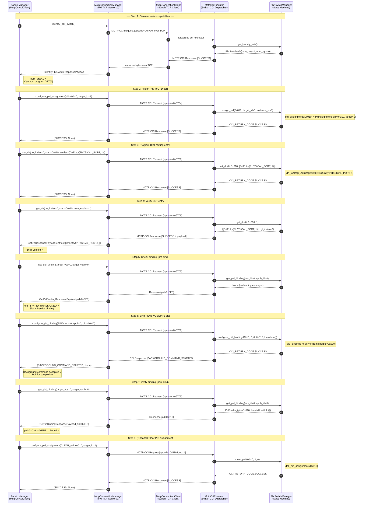
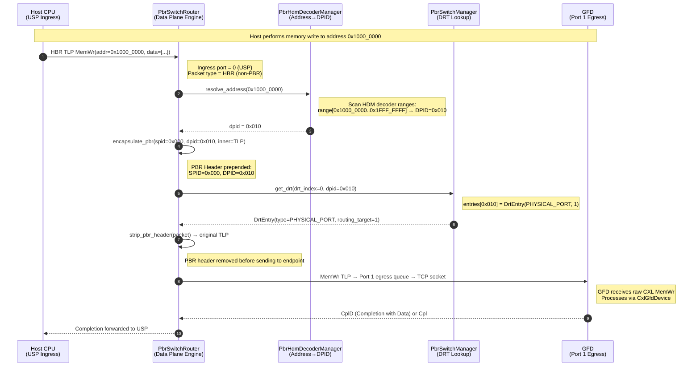
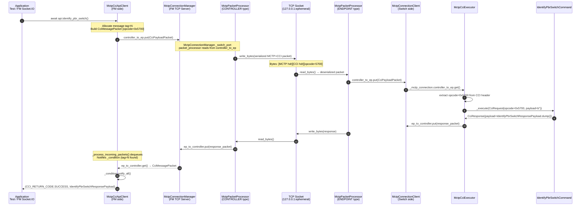
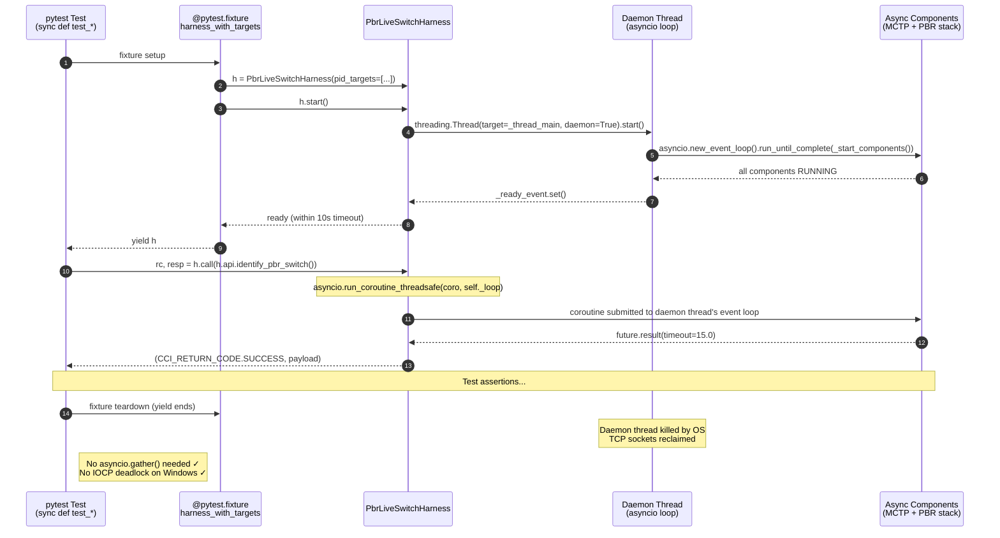

# GFD / PBR — Sequence Diagrams

**Project:** opencis-core CXL 4.0 PBR Simulator  
**Spec:** CXL 4.0 Rev 1.0 §7.7.13  
**Date:** May 2026

---

## 1. GFD Commissioning — 8-Step FM Workflow

The Fabric Manager executes this sequence to bring a GFD into a fully routed state.



---

## 2. Data Plane Packet Routing

How a TLP from the Host CPU reaches the GFD via PBR fabric routing.



---

## 3. MCTP CCI Request/Response — Full Transport Flow

End-to-end bytes on the wire from API call to response.



---

## 4. RunnableComponent Lifecycle

Every async component (`MctpConnectionManager`, `MctpCciExecutor`, etc.) follows this lifecycle.

```mermaid
sequenceDiagram
    autonumber
    participant TEST as Test / Caller
    participant COMP as RunnableComponent
    participant LOOP as asyncio Event Loop

    TEST->>COMP: task = await comp.run_wait_ready()
    Note over COMP: Creates asyncio.Task for run()
    LOOP->>COMP: schedules _run() coroutine

    COMP->>COMP: _change_status_to_running()
    Note over COMP: _condition.notify_all()<br/>_status = RUNNING

    COMP-->>TEST: task handle returned
    Note right of TEST: Component is now RUNNING<br/>Test can send commands

    TEST->>TEST: ... send CCI commands via harness.call() ...

    TEST->>COMP: await comp.stop()
    Note over COMP: _stop() called<br/>Signals internal queues with None sentinel
    COMP->>COMP: _change_status_to_stopped()
    COMP-->>TEST: stop() returns
```

---

## 5. Test Harness Architecture (daemon-thread pattern)

How the pytest test harness avoids Windows IOCP deadlocks.


