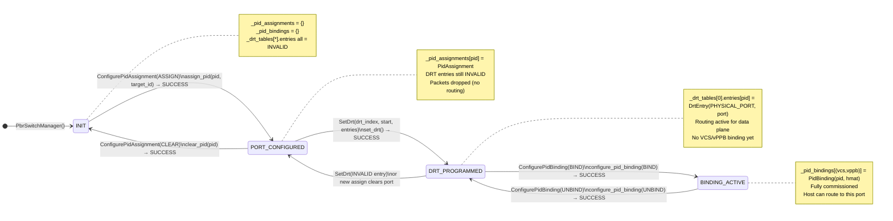
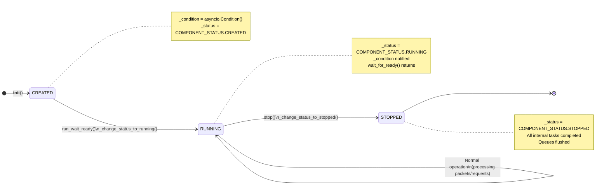
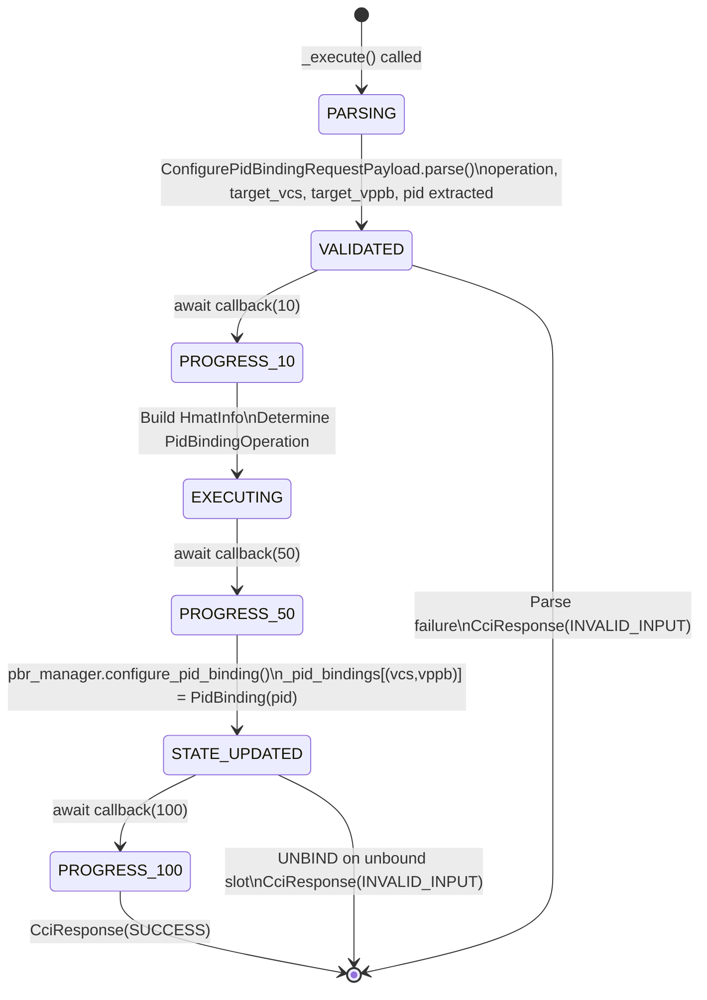
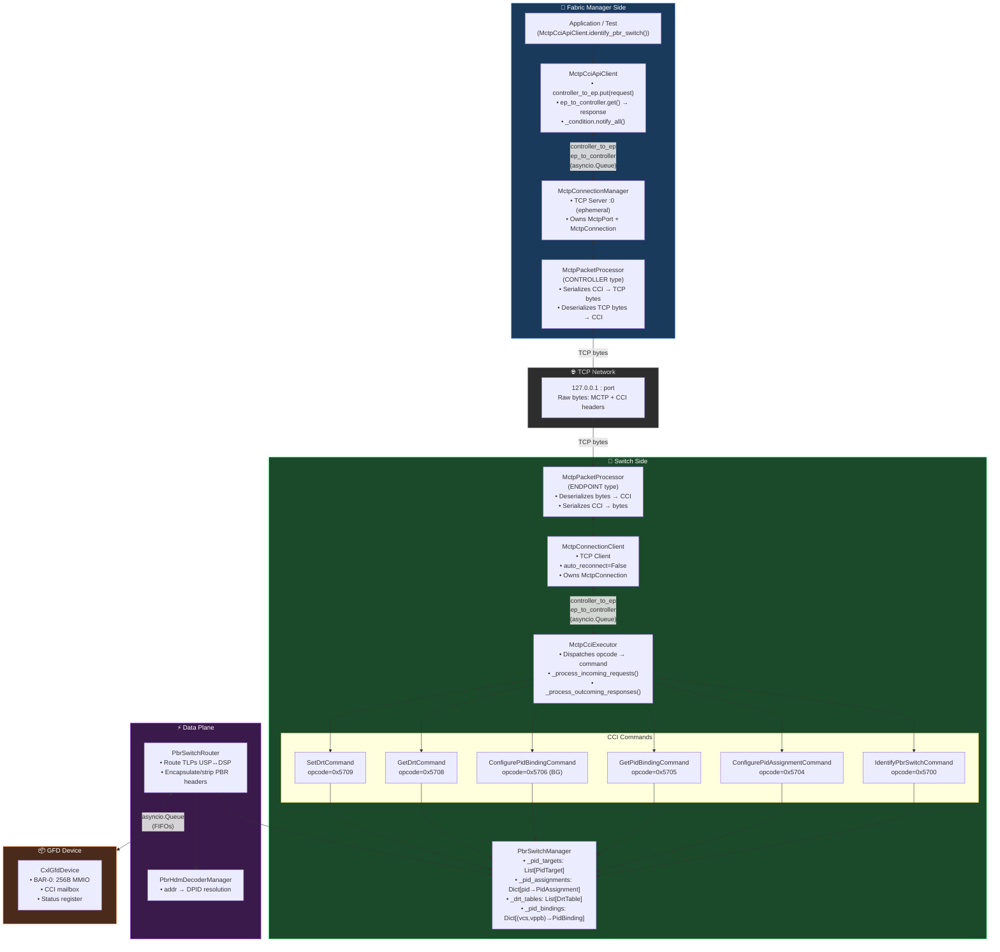

# GFD / PBR — UML Class & State Diagrams

**Project:** opencis-core CXL 4.0 PBR Simulator  
**Date:** May 2026

---

## 1. UML Class Diagram

```mermaid
classDiagram
    direction TB

    %% ─── Base Infrastructure ────────────────────────────────────────────
    class RunnableComponent {
        <<abstract>>
        +_status: COMPONENT_STATUS
        +_condition: asyncio.Condition
        +_label: str
        +run() Task
        +run_wait_ready() Task
        +stop() None
        +wait_for_ready() None
        #_run()* None
        #_stop()* None
        #_change_status_to_running() None
        #_change_status_to_stopped() None
    }

    class ServerComponent {
        -_host: str
        -_port: int
        -_handle_client: Callable
        -_stop_callback: Callable
        -_server_task: Task
        -_clients: set
        +get_port() int
        #_run() None
        #_stop() None
        +_create_server() asyncio.Server
    }

    %% ─── MCTP Transport Layer ──────────────────────────────────────────
    class MctpConnectionManager {
        -_host: str
        -_port: int
        -_switch_port: MctpPort
        -_server_component: ServerComponent
        +get_mctp_connection() MctpConnection
        #_run() None
        #_stop() None
        #_handle_client(reader, writer) None
    }

    class MctpConnectionClient {
        -_host: str
        -_port: int
        -_auto_reconnect: bool
        -_mctp_connection: MctpConnection
        -_packet_processor: MctpPacketProcessor
        +get_mctp_connection() MctpConnection
        #_run() None
        #_stop() None
    }

    class MctpPacketProcessor {
        -_reader: asyncio.StreamReader
        -_writer: asyncio.StreamWriter
        -_mctp_connection: MctpConnection
        -_type: MCTP_PACKET_PROCESSOR_TYPE
        #_run() None
        #_stop() None
        -_process_incoming_packets() None
        -_process_outgoing_packets() None
    }

    class MctpConnection {
        +controller_to_ep: asyncio.Queue
        +ep_to_controller: asyncio.Queue
    }

    %% ─── CCI Executor (Switch side) ─────────────────────────────────────
    class MctpCciExecutor {
        -_mctp_connection: MctpConnection
        -_cci_executor: CciExecutor
        -_downstream_port_connections: dict
        +register_cci_commands(commands) None
        #_run() None
        #_stop() None
        -_process_incoming_requests() None
        -_process_outcoming_responses() None
    }

    class CciExecutor {
        -_commands: Dict~int, CciCommand~
        +register_command(cmd) None
        +execute(request) CciResponse
    }

    %% ─── CCI API Client (FM side) ────────────────────────────────────────
    class MctpCciApiClient {
        -_mctp_connection: MctpConnection
        -_tag: int
        -_responses: Dict~int, CciMessagePacket~
        -_condition: asyncio.Condition
        +identify_pbr_switch() tuple
        +configure_pid_assignment(req) tuple
        +get_pid_binding(req) tuple
        +configure_pid_binding(req) tuple
        +get_drt(req) tuple
        +set_drt(req) tuple
        #_run() None
        #_stop() None
        -_send_request(req) CciMessagePacket
        -_get_response(tag) CciMessagePacket
    }

    %% ─── PBR State Machine ──────────────────────────────────────────────
    class PbrSwitchManager {
        -_label: str
        -_switch_info: PbrSwitchInfo
        -_drt_tables: List~DrtTable~
        -_pid_targets: List~PidTarget~
        -_pid_assignments: Dict~int, PidAssignment~
        -_pid_bindings: Dict~tuple, PidBinding~
        +get_identify_info() PbrSwitchInfo
        +assign_pid(pid, target_id, instance_id) CCI_RETURN_CODE
        +clear_pid(pid, target_id, instance_id) CCI_RETURN_CODE
        +get_drt(drt_index, start, num) tuple
        +set_drt(drt_index, start, entries) CCI_RETURN_CODE
        +get_pid_binding(vcs_id, vppb_id) PidBinding
        +configure_pid_binding(op, vcs, vppb, pid, hmat) CCI_RETURN_CODE
    }

    class PbrSwitchInfo {
        +gae_support_map: int
        +num_drts: int
        +num_rgts: int
        +random_supported: bool
        +congestion_avoidance_supported: bool
        +routing_caps_byte() int
    }

    class DrtTable {
        +associated_rgt_index: int
        +entries: List~DrtEntry~
    }

    class DrtEntry {
        +entry_type: DrtEntryType
        +routing_target: int
        +dump() bytes
        +parse(data, offset)$ DrtEntry
    }

    class DrtEntryType {
        <<enumeration>>
        INVALID = 0
        PHYSICAL_PORT = 1
        RGT_INDEX = 2
        RESERVED = 3
    }

    %% ─── Data Plane ─────────────────────────────────────────────────────
    class PbrSwitchRouter {
        -_upstream_fifos: dict
        -_downstream_fifos: dict
        -_pbr_manager: PbrSwitchManager
        -_hdm_decoder: PbrHdmDecoderManager
        #_run() None
        -_route_packet(ingress_port, packet) None
        -_encapsulate_pbr(spid, dpid, pkt) PbrPacket
    }

    class PbrHdmDecoderManager {
        -_ranges: List~HdmRange~
        +resolve_address(addr) int
    }

    %% ─── CCI Commands ────────────────────────────────────────────────────
    class CciForegroundCommand {
        <<abstract>>
        +OPCODE: int
        #_execute(request)* CciResponse
        +create_cci_request()$ CciRequest
    }

    class CciBackgroundCommand {
        <<abstract>>
        +OPCODE: int
        #_execute(request, callback)* CciResponse
        +create_cci_request()$ CciRequest
    }

    class IdentifyPbrSwitchCommand {
        +OPCODE = 0x5700
        -_pbr_switch_manager: PbrSwitchManager
        #_execute(request) CciResponse
        +parse_response_payload(data)$ IdentifyPbrSwitchResponsePayload
    }

    class ConfigurePidAssignmentCommand {
        +OPCODE = 0x5704
        -_pbr_switch_manager: PbrSwitchManager
        #_execute(request) CciResponse
    }

    class GetPidBindingCommand {
        +OPCODE = 0x5705
        -_pbr_switch_manager: PbrSwitchManager
        #_execute(request) CciResponse
        +parse_response_payload(data)$ GetPidBindingResponsePayload
    }

    class ConfigurePidBindingCommand {
        +OPCODE = 0x5706
        -_pbr_switch_manager: PbrSwitchManager
        #_execute(request, callback) CciResponse
    }

    class GetDrtCommand {
        +OPCODE = 0x5708
        -_pbr_switch_manager: PbrSwitchManager
        #_execute(request) CciResponse
        +parse_response_payload(data)$ GetDrtResponsePayload
    }

    class SetDrtCommand {
        +OPCODE = 0x5709
        -_pbr_switch_manager: PbrSwitchManager
        #_execute(request) CciResponse
    }

    %% ─── Inheritance ─────────────────────────────────────────────────────
    RunnableComponent <|-- ServerComponent
    RunnableComponent <|-- MctpConnectionManager
    RunnableComponent <|-- MctpConnectionClient
    RunnableComponent <|-- MctpPacketProcessor
    RunnableComponent <|-- MctpCciExecutor
    RunnableComponent <|-- MctpCciApiClient
    RunnableComponent <|-- PbrSwitchRouter

    CciForegroundCommand <|-- IdentifyPbrSwitchCommand
    CciForegroundCommand <|-- ConfigurePidAssignmentCommand
    CciForegroundCommand <|-- GetPidBindingCommand
    CciForegroundCommand <|-- GetDrtCommand
    CciForegroundCommand <|-- SetDrtCommand
    CciBackgroundCommand <|-- ConfigurePidBindingCommand

    %% ─── Associations ────────────────────────────────────────────────────
    MctpConnectionManager *-- ServerComponent : contains
    MctpConnectionManager *-- MctpConnection  : owns _switch_port.mctp_connection
    MctpConnectionClient  *-- MctpConnection  : owns _mctp_connection
    MctpConnectionClient  *-- MctpPacketProcessor : creates per connection
    MctpCciExecutor       o-- MctpConnection  : uses (switch-side)
    MctpCciExecutor       *-- CciExecutor     : contains
    MctpCciApiClient      o-- MctpConnection  : uses (fm-side)
    CciExecutor           o-- CciForegroundCommand : dispatches to
    CciExecutor           o-- CciBackgroundCommand : dispatches to
    IdentifyPbrSwitchCommand     o-- PbrSwitchManager : queries
    ConfigurePidAssignmentCommand o-- PbrSwitchManager : mutates
    GetPidBindingCommand         o-- PbrSwitchManager : queries
    ConfigurePidBindingCommand   o-- PbrSwitchManager : mutates
    GetDrtCommand                o-- PbrSwitchManager : queries
    SetDrtCommand                o-- PbrSwitchManager : mutates
    PbrSwitchRouter       o-- PbrSwitchManager      : queries DRT
    PbrSwitchRouter       o-- PbrHdmDecoderManager  : resolves addresses
    PbrSwitchManager      *-- PbrSwitchInfo : owns
    PbrSwitchManager      *-- DrtTable      : owns 1..N
    DrtTable              *-- DrtEntry      : contains 4096
    DrtEntry              o-- DrtEntryType  : uses
```

---

## 2. PbrSwitchManager State Machine

---

## 3. RunnableComponent Lifecycle

---

## 4. ConfigurePidBinding — Background Command Progress

---

## 5. Full System Architecture Diagram

